# SPONG v3.6.8 — Network & Services Monitor

**SPONG** (Simple Preventive Operations Network Guardian) is a network and services monitoring system originally written in Perl. v3 is a complete rewrite in Python 3, keeping full compatibility with the original database and configuration files.

> **Features:** multi-group host matrix · RRD graphs (SmokePing-style ping) · ACK/acknowledgements · 7-language UI · dark mode · mobile-responsive UI · historical uptime % · on-demand service checks · cached graph API · .deb packages · migration script from Perl config · web config UI · safe host rename · alert schedule suppression

[](https://github.com/mostro3000/spong-v3/actions/workflows/build-deb.yml)
[](https://www.gnu.org/licenses/gpl-3.0)

---

> _Documentación completa en español a continuación._

---

## Capturas de pantalla

| Vista de grupos (modo claro) | Modo oscuro |
|---|---|
| 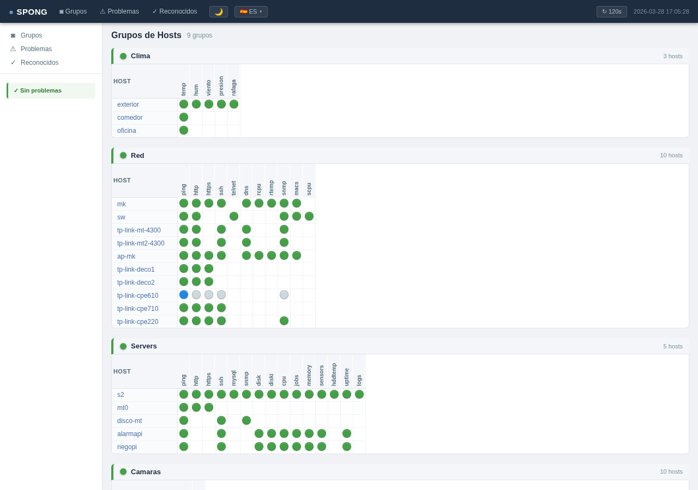 | 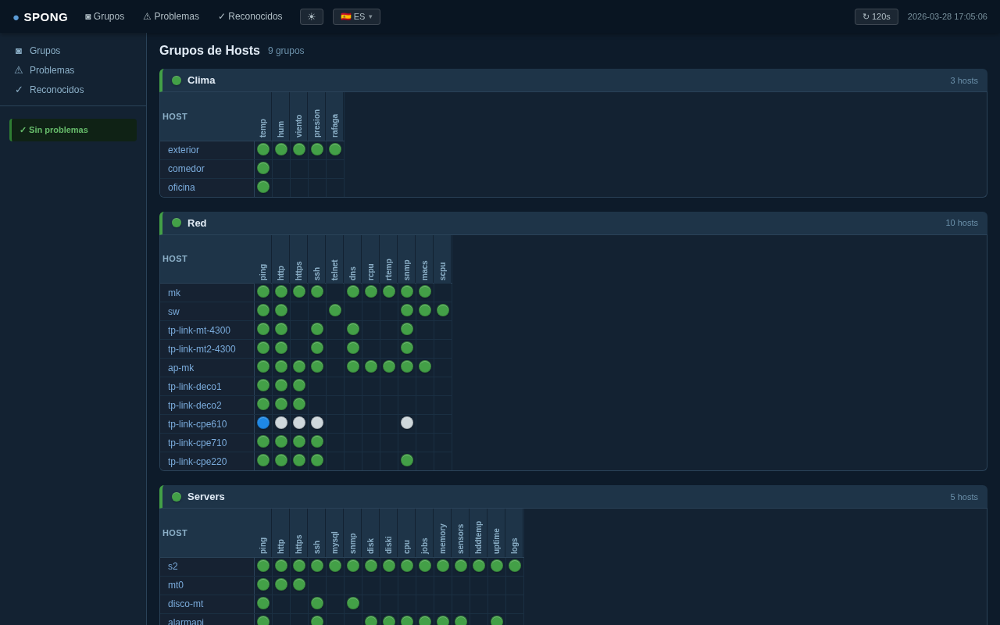 |

| Vista de host (riego-patio: temp/hum/co2) | Página de problemas |
|---|---|
| 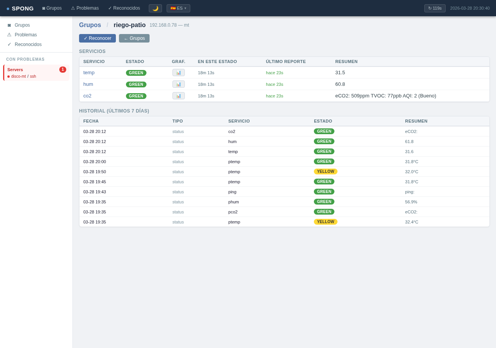 | 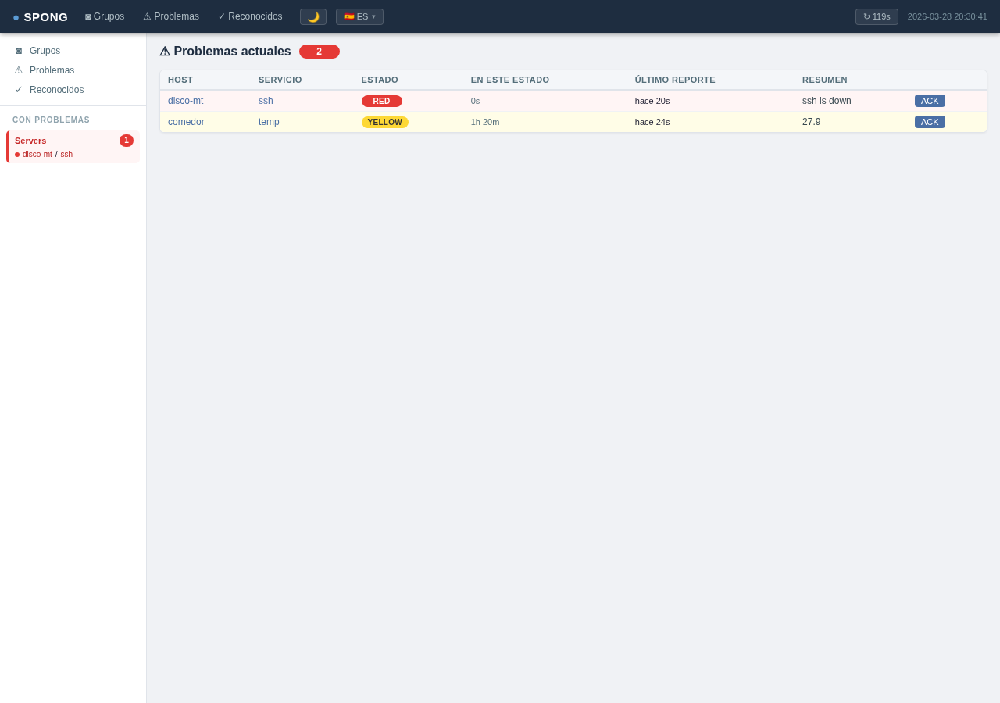 |

| Grupo Clima (sensores IoT + SSH) |
|---|
| 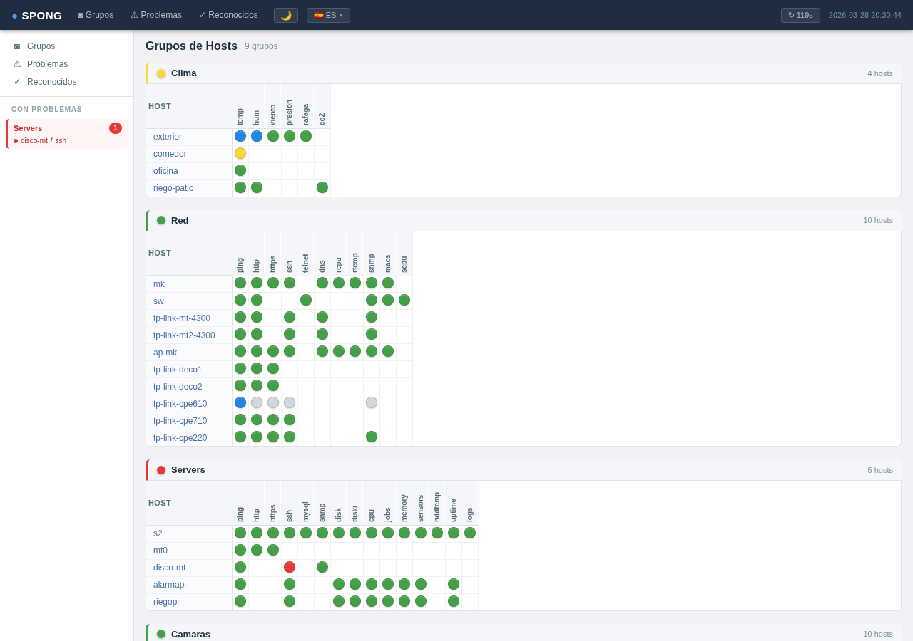 |

| Gráfico ping estilo SmokePing (lightbox) | Gráfico HTTP tiempo de respuesta (lightbox) |
|---|---|
| 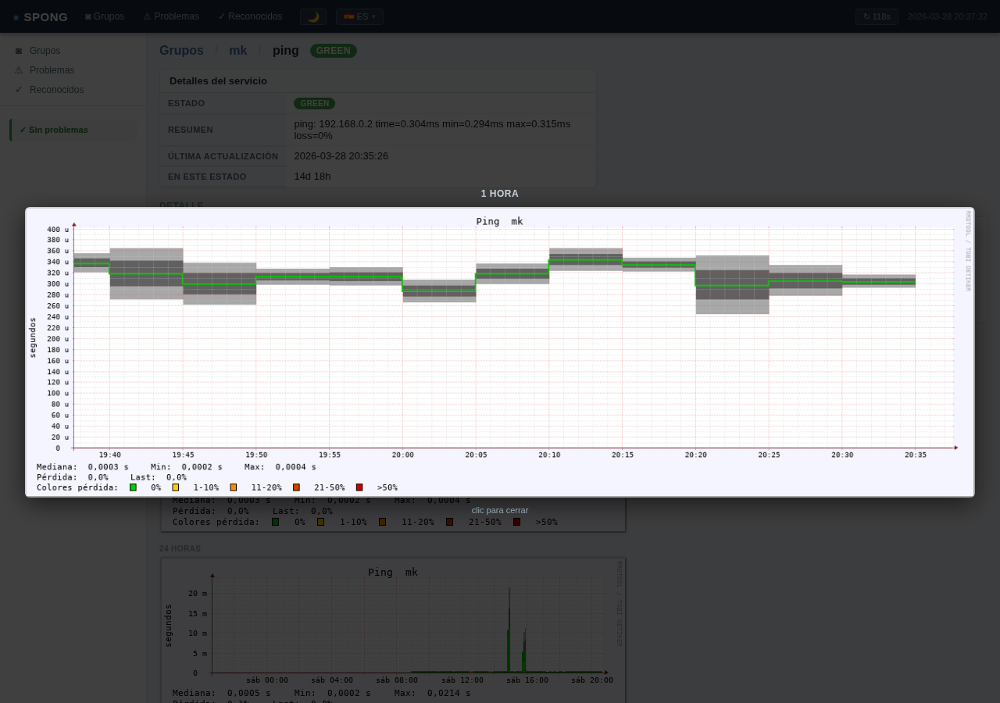 | 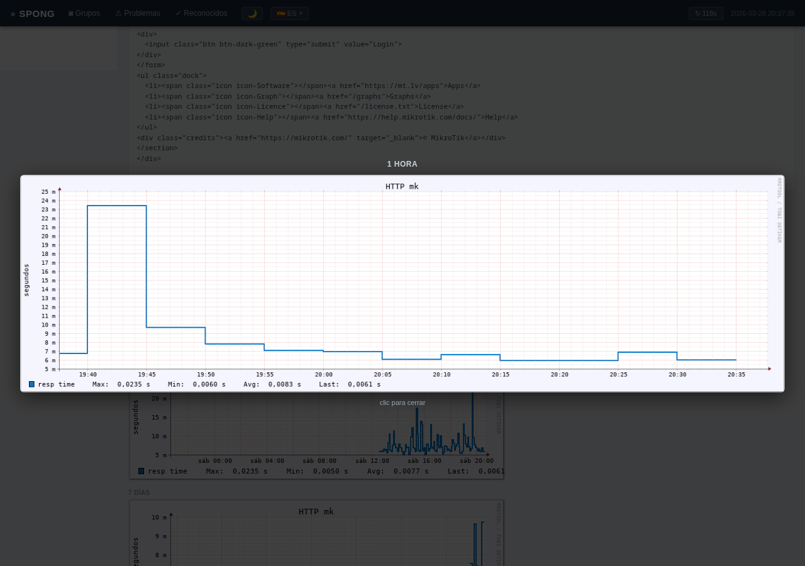 |

### Vista mobile (responsive)

| Grupos (modo claro) | Sidebar / menú | Detalle de host |
|---|---|---|
| 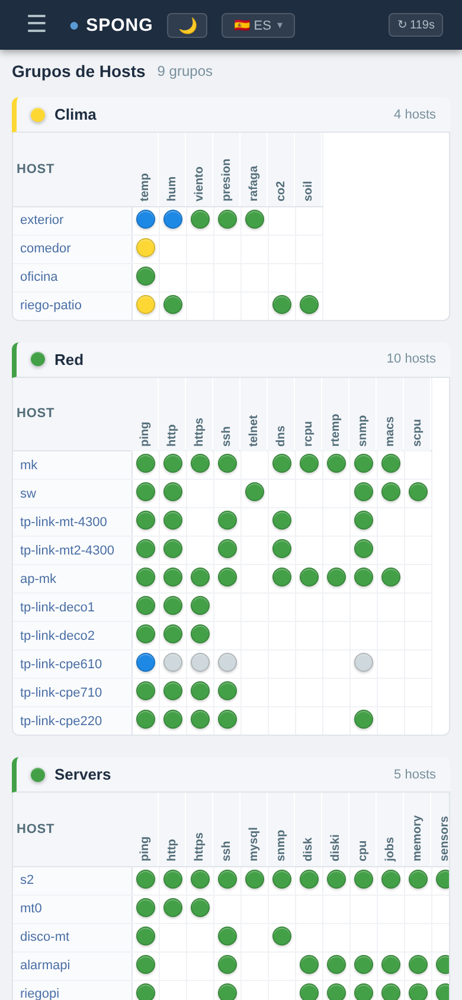 | 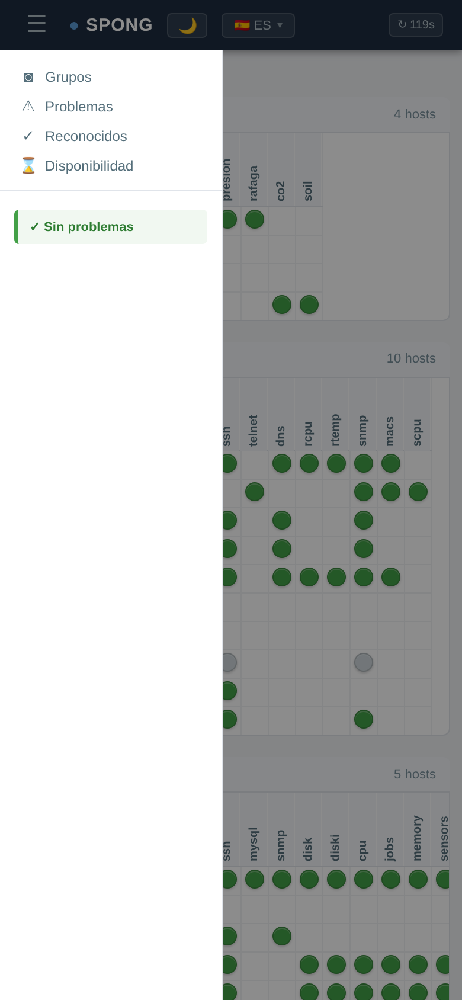 | 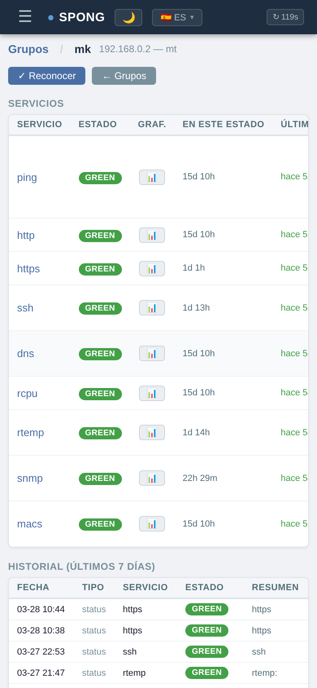 |

| Grupos (modo oscuro) | Sidebar (modo oscuro) |
|---|---|
| 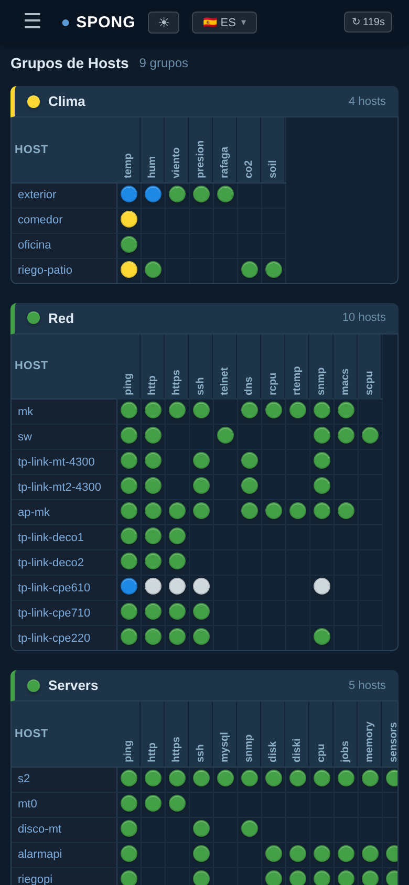 | 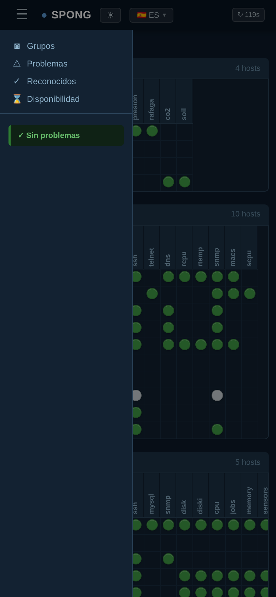 |

---

## Instalación rápida

### Servidor (Debian / Ubuntu)

```bash
# 1. Descargar el .deb desde Releases
wget https://github.com/mostro3000/spong-v3/releases/latest/download/spong-server_3.6.2-1_all.deb

# 2. Instalar (el postinst configura dependencias y activa los 4 servicios systemd)
dpkg -i spong-server_3.6.2-1_all.deb

# 3. Editar la configuración
nano /usr/local/spong/etc/spong.yaml    # servidor, thresholds, checks
nano /usr/local/spong/etc/hosts.yaml    # hosts a monitorear
nano /usr/local/spong/etc/groups.yaml   # grupos de hosts

# 4. Reiniciar para que tome la config
systemctl restart spong-server spong-network spong-client spong-web

# 5. Abrir la interfaz web
xdg-open http://localhost:8090/
```

### Cliente remoto (en otro host)

```bash
wget https://github.com/mostro3000/spong-v3/releases/latest/download/spong-client_3.6.2-1_all.deb
dpkg -i spong-client_3.6.2-1_all.deb   # instalación interactiva: pregunta servidor, hostname, checks
```

> Si el asset `3.6.2-1` todavía no está publicado en GitHub Releases, construir localmente con `cd packaging && bash build-deb.sh` o crear el tag `v3.6.2` para que CI publique los `.deb`.

### Migración desde SPONG Perl (spong.conf / spong.hosts / spong.groups)

```bash
cd /etc/spong/   # o donde estén los archivos viejos
python3 /usr/local/spong/bin/spong-migrate.py --all --outdir /usr/local/spong/etc/
```

---

## Estado actual del código

SPONG v3.6.8 está organizado como una aplicación Python 3 con cuatro procesos principales: servidor TCP asyncio, agente de red, agente local y UI Flask. La base de datos sigue siendo de archivos para mantener compatibilidad con SPONG Perl; los RRD se actualizan desde el servidor cuando llegan estados nuevos.

El repositorio contiene el código Python en `spong/`, la UI en `web/`, wrappers ejecutables en `bin/`, configuración en `etc/`, empaquetado Debian en `packaging/` y capturas en `docs/screenshots/`. También conserva datos locales bajo `var/` y código histórico Perl en `lib/`, `cgi-bin/` y `www/`; esos árboles no son necesarios para entender la implementación Python nueva.

Resumen operativo:
- **Versión actual:** `spong.__version__ = 3.6.8`, `setup.py = 3.6.8`, paquetes `3.6.8-1`
- **Runtime:** Python 3.10+ para instalación por `setup.py`; los paquetes Debian declaran `python3 >= 3.9`
- **Dependencias principales:** `pyyaml`, `flask`, `werkzeug`, `rrdtool`, `fping`, `snmp`, `rpcbind`; `tinytuya` solo para plugins Tuya
- **Persistencia:** `/usr/local/spong/var/database`, `/usr/local/spong/var/rrd`, `/usr/local/spong/var/archives`
- **CI/CD:** GitHub Actions construye `.deb` en push/PR y publica assets cuando se empuja un tag `v*`

---

## Índice

1. [Arquitectura general](#1-arquitectura-general)
2. [Procesos / Daemons](#2-procesos--daemons)
3. [Arranque y parada](#3-arranque-y-parada)
4. [Configuración](#4-configuración)
5. [Plugins del cliente (checks locales)](#5-plugins-del-cliente-checks-locales)
6. [Plugins de red (checks remotos)](#6-plugins-de-red-checks-remotos)
7. [Colores de estado](#7-colores-de-estado)
8. [Interfaz web](#8-interfaz-web)
9. [Gráficos RRD](#9-gráficos-rrd)
10. [Reconocimientos (ACKs)](#10-reconocimientos-acks)
11. [Base de datos](#11-base-de-datos)
12. [Logs](#12-logs)
13. [Mantenimiento](#13-mantenimiento)
14. [Empaquetado .deb](#14-empaquetado-deb)
15. [GitHub Actions (CI)](#15-github-actions-ci)
16. [Historial de cambios](#16-historial-de-cambios)

---

## 1. Arquitectura general

```
┌─────────────────────────────────────────────────────────────┐
│                        SPONG Server                          │
│                   (spong/server.py :1998)                    │
│  - Recibe updates via TCP 1998                               │
│  - Responde queries legacy/texto via TCP 1999                │
│  - Acepta protocolo BigBrother compatible via TCP 1984       │
│  - Escribe en base de datos                                  │
│  - Actualiza RRDs                                            │
│  - Ejecuta scanner de servicios stale                        │
└──────────┬────────────────────────┬────────────────────────--┘
           │ TCP :1998              │ TCP :1998
           │                        │
┌──────────▼──────────┐   ┌─────────▼──────────────┐
│   Network Agent      │   │    Client Agent          │
│ (spong/network_      │   │  (spong/client_agent.py) │
│  agent.py)           │   │                          │
│                      │   │  Corre en el host local  │
│  Chequea hosts        │   │  y ejecuta plugins       │
│  remotos via red:     │   │  locales: disk, cpu,     │
│  ping, http, ssh,     │   │  memory, jobs, sensors,  │
│  mysql, snmp, dns...  │   │  hddtemp, uptime, logs,  │
│                      │   │  speedtest               │
└─────────────────────┘   └──────────────────────────┘

┌─────────────────────────────────────────────────────────────┐
│                     Interfaz Web (Flask)                     │
│              (web/app.py - puerto 8090)                      │
│  - Lee directamente de la base de datos                      │
│  - Muestra estado, gráficos RRD, historial                   │
│  - Gestiona reconocimientos                                  │
└─────────────────────────────────────────────────────────────┘
```

**Flujo de datos:**
1. El **Network Agent** hace ping/http/ssh/etc. a los hosts remotos
2. El **Client Agent** ejecuta checks locales (disk, cpu, etc.) en el host donde corre
3. Ambos envían resultados al **Server** via TCP (`server.update_port`, default 1998)
4. El **Server** guarda los datos en la base, dispara notificaciones si corresponde y actualiza los RRDs
5. La **Interfaz Web** lee la base, cachea snapshots/graphs y muestra estado, historial y ACKs

---

## 2. Procesos / Daemons

| Proceso | Archivo | Puerto | Descripción |
|---------|---------|--------|-------------|
| `spong-server` | `spong/server.py` | TCP 1998, 1999, 1984 | Servidor central. Recibe updates, responde queries, acepta BigBrother, escribe DB, actualiza RRDs, escanea stale |
| `spong-network` | `spong/network_agent.py` | — | Agente de red. Chequea hosts remotos via ping, http, ssh, etc. |
| `spong-client` | `spong/client_agent.py` | — | Agente local. Ejecuta checks en el host definido por `hostname:` o `socket.gethostname()` |
| `spong-web` | `web/app.py` | TCP 8090 | Interfaz web Flask |

---

## 3. Arranque y parada

SPONG arranca automáticamente al iniciar el sistema operativo mediante **systemd**. Los unit files están en `/etc/systemd/system/spong-*.service`.

### Comandos systemd

```bash
# Estado de todos los servicios
systemctl status spong-server spong-network spong-client spong-web

# Arrancar / parar / reiniciar un servicio
systemctl start   spong-server
systemctl stop    spong-network
systemctl restart spong-web

# Reiniciar todos
systemctl restart spong-server spong-network spong-client spong-web

# Habilitar / deshabilitar arranque automático
systemctl enable  spong-server   # ya habilitado
systemctl disable spong-network  # si se quiere deshabilitar
```

### Logs via journald

```bash
journalctl -u spong-server  -f        # seguir log en tiempo real
journalctl -u spong-network --since "1 hour ago"
journalctl -u spong-web     -n 50     # últimas 50 líneas
```

Los logs también se guardan en `/var/log/spong-*.log` (append).

### Dependencias de arranque

```
spong-server   ← arranca primero (necesita red)
spong-network  ← requiere spong-server
spong-client   ← requiere spong-server
spong-web      ← requiere spong-server
```

### Aplicar cambios de código o configuración

Los procesos cargan el código y la configuración **solo al arrancar**. Luego de editar cualquier archivo `.py` o `.yaml` hay que reiniciar el proceso afectado:

```bash
systemctl restart spong-network   # después de editar plugins de red o rrd.py... ver tabla
```

| Archivo modificado | Proceso a reiniciar |
|--------------------|---------------------|
| `spong/plugins/network/*.py` | `spong-network` |
| `spong/plugins/client/*.py` | `spong-client` |
| `spong/rrd.py`, `spong/server.py` | `spong-server` |
| `web/app.py`, `web/templates/` | `spong-web` |
| `etc/hosts.yaml`, `etc/groups.yaml` | todos |
| `etc/spong.yaml` | proceso afectado |
| `/etc/apache2/sites-available/*.conf` | `apache2` (`systemctl restart apache2`) |

> **Nota:** `spong/rrd.py` es importado por `spong-server`. Los cambios en `rrd.py` requieren reiniciar `spong-server`, no `spong-network`.

La **interfaz web** carga la configuración al iniciar. Reiniciar `spong-web` después de cambios en `spong.yaml`, `hosts.yaml` o `groups.yaml`.

### Ejecución local / diagnóstico

Los wrappers en `bin/` cargan el código desde `/usr/local/spong` y aceptan `--config` para usar otro `spong.yaml`.

```bash
# Servidor en foreground con logs DEBUG
/usr/local/spong/bin/spong-server --nodaemonize --debug

# Un ciclo de checks remotos y salida
/usr/local/spong/bin/spong-network --nosleep --debug

# Un ciclo de checks locales y salida
/usr/local/spong/bin/spong-client --nosleep --debug

# Enviar un estado manual
/usr/local/spong/bin/spong-status --host mi-host --service prueba \
  --color yellow --summary "prueba manual" --message "detalle opcional"

# Listar y crear ACKs desde CLI
/usr/local/spong/bin/spong-ack --list
/usr/local/spong/bin/spong-ack mi-host "http|https" +4h --contact admin --message "mantenimiento"

# Limpieza/archivo manual de base de datos
/usr/local/spong/bin/spong-cleanup --old-service 20 --old-history 30
```

`spong-network` y `spong-client` soportan `--restart` y `--kill`: envían `SIGHUP` o `SIGQUIT` al PID guardado en `tmp_path`.

---

## 4. Configuración

Todos los archivos de configuración están en `/usr/local/spong/etc/`.

### 4.1 `spong.yaml` — Configuración principal

```yaml
server:
  host: "s2"          # hostname del servidor SPONG
  update_port: 1998   # puerto donde el server recibe updates
  query_port: 1999    # puerto de queries (legacy)
  bb_port: 1984       # puerto BigBrother (legacy)
  alarm_timeout: 10   # timeout en segundos para alarmas

hostname: "s2"         # opcional: nombre que usa spong-client; si falta usa socket.gethostname()
tmp_path: "/usr/local/spong/tmp"

database:
  path: "/usr/local/spong/var/database"
  archive_path: "/usr/local/spong/var/archives"

sleep:
  default: 300          # segundos entre ciclos (default)
  spong-client: 500     # ciclo del cliente local
  spong-network: 300    # ciclo del agente de red

network:
  crit_warn_level: 1    # reintentos antes de reportar crítico
  recheck_sleep: 15     # segundos entre reintentos
  workers: 30           # hilos máximos dentro de cada lote
  batch_size: 20        # hosts por lote de chequeo

# Plugins del cliente a ejecutar
checks: "disk diski cpu jobs logs memory sensors hddtemp uptime speedtest"

thresholds:
  disk:
    warn:
      ALL: 90       # umbral warn para todos los filesystems
      /usr: 95      # umbral específico para /usr
    crit:
      ALL: 95
  cpu:
    warn: 7.0       # load average warn
    crit: 8.0
  memory:
    warn: 90        # % uso físico warn
    crit: 95
  hddtemp:
    warn: 50        # °C
    crit: 60
  iftraffic:
    warn: 70        # % de utilizacion por interfaz
    crit: 90
  speedtest:
    down_warn: 10   # Mbps
    down_crit: 5
    up_warn: 10
    up_crit: 5
    ping_warn: 50   # ms
    ping_crit: 100
    interval: 3600  # segundos mínimos entre mediciones
    server_id: null # opcional: ID fijo de servidor Ookla

# Procesos que el check "jobs" debe verificar
processes:
  crit:             # si falta → rojo
    - fauxmo
    - rtl_tcp
    - motion
    - mqttorrd
    - asterisk
    - lighttpd
  warn: []          # si falta → amarillo

web:
  auth_user: "spong"        # Basic Auth (vacío = sin auth)
  auth_password: "spong123"
  auth_password_hash: ""    # preferido: hash Werkzeug scrypt/pbkdf2
  # Usuarios opcionales para /config/. Roles: admin, editor, add, read.
  # add permite agregar sin editar, borrar ni restaurar.
  config_users:
    config:
      password_hash: "scrypt:..."
      role: "admin"
    altas:
      password_hash: "scrypt:..."
      role: "add"
  general_history_days: 7   # días a mostrar en /history
  auto_refresh_seconds: 300 # refresh automático en vistas generales; 0 deshabilita
  graph_cache_seconds: 60   # TTL de caché para /rrd/*.png
  graph_cache_entries: 512  # máximo de entradas de caché de gráficos
  check_cooldown_seconds: 15 # rate limit de checks on-demand por host/servicio

cleanup:
  old_service_days: 20   # días hasta borrar servicios sin datos
  old_history_days: 30   # días de historial a conservar
```

Las configuraciones migradas desde SPONG Perl pueden conservar claves legacy (`web.frames`, `web.gifs_url`, `commands.*`, etc.). La implementación Python usa solo las claves documentadas o consultadas por los plugins actuales.

### 4.2 `hosts.yaml` — Definición de hosts

```yaml
contacts:
  mt:
    name: "mt"
    email: "mt@localhost"

hosts:
  s2:
    services: "ping: http ssh mysql snmp disk diski cpu jobs memory sensors hddtemp uptime"
    contact: "mt"
    ip_addr: ["192.168.0.11"]

  cam3d:
    services: "ping"
    contact: "mt"
    ip_addr: ["192.168.0.132"]
```

**Formato de servicios:**
- Los servicios se listan separados por espacios
- El `:` después de un servicio significa **stop_after**: si ese servicio falla, no se chequean los siguientes. Ejemplo: `ping: http ssh` — si ping falla, no se intenta http ni ssh
- El orden importa: determina el orden de visualización en la interfaz web
- Los servicios del **cliente local** (`disk`, `cpu`, `memory`, `jobs`, `speedtest`, etc.) deben estar en la lista del host que reporta `spong-client`

**Configuración opcional para `iftraffic`:**

```yaml
  mk:
    services: "ping: http https ssh dns rcpu rtemp snmp macs iftraffic"
    contact: "mt"
    ip_addr: ["192.168.0.2"]
    iftraffic_interfaces: ["ether1", "bridge*", "sfp-sfpplus1"]
    iftraffic_ignore: ["pppoe-*", "veth*"]
```

- `iftraffic_interfaces`: whitelist de nombres o patrones tipo shell (`bridge*`, `ether1`)
- `iftraffic_ignore`: interfaces a excluir del cálculo
- si no se define `iftraffic_interfaces`, el plugin toma todas las interfaces `admin up` no ignoradas
- la primera corrida queda en `clear` con el mensaje `iftraffic: esperando segunda muestra`, porque necesita dos lecturas para calcular el promedio

### 4.3 `groups.yaml` — Grupos de hosts

```yaml
groups:
  servers:
    name: "Servers"
    members:
      - s2
      - mt0
      - disco-mt
    display: true
    compress: true   # no usado actualmente, todos usan vista matriz
```

Los grupos se muestran en la interfaz web en el orden en que aparecen en este archivo.

---

## 5. Plugins del cliente (checks locales)

El `spong-client` ejecuta estos plugins en el host local. El nombre reportado sale de `hostname:` en `spong.yaml`; si falta, usa `socket.gethostname()`. Los checks se configuran en `spong.yaml` → `checks`.

| Plugin | Servicio | Qué mide | Umbrales en spong.yaml |
|--------|----------|----------|------------------------|
| `disk.py` | `disk` | Uso de filesystems (`df`) | `thresholds.disk.warn/crit` |
| `diski.py` | `diski` | Uso de inodos (`df -i`) | `thresholds.disk.warn/crit` |
| `cpu.py` | `cpu` | Load average y jobs | `thresholds.cpu.warn/crit` |
| `jobs.py` | `jobs` | Procesos requeridos corriendo | `processes.crit/warn` |
| `memory.py` | `memory` | Uso de memoria RAM | `thresholds.memory.warn/crit` |
| `sensors.py` | `sensors` | Temperatura CPU/cores (lm-sensors) | `sensor_thresholds.*` |
| `hddtemp.py` | `hddtemp` | Temperatura de discos (`hddtemp`) | `thresholds.hddtemp.warn/crit` |
| `uptime.py` | `uptime` | Uptime del sistema | — |
| `logs.py` | `logs` | Patrones en archivos de log | `log_checks[]` en spong.yaml |
| `speedtest.py` | `speedtest` | Bajada/subida/ping/jitter via Ookla CLI | `thresholds.speedtest.*` |
| `processes.py` | `jobs` | Alias legacy del check de procesos | `processes.crit/warn` |

Para que la UI muestre los checks locales, los mismos servicios deben figurar también en `hosts.yaml` para ese hostname.

---

## 6. Plugins de red (checks remotos)

El `spong-network` ejecuta estos plugins contra los hosts remotos configurados en `hosts.yaml`.

| Plugin | Servicio | Qué chequea |
|--------|----------|-------------|
| `ping.py` | `ping` | Conectividad ICMP — 10 pings por ciclo, reporta min/avg/max/loss |
| `http.py` | `http` | HTTP GET, código de respuesta, tiempo de respuesta |
| `https.py` | `https` | HTTPS GET con fallback SSL legacy y TCP para certs débiles; alerta por vencimiento de certificado |
| `ssh.py` | `ssh` | Conexión TCP puerto 22, banner SSH, tiempo de respuesta |
| `mysql.py` | `mysql` | Conexión TCP puerto 3306, tiempo de respuesta |
| `snmp.py` | `snmp` | Consulta SNMPv1 (sysDescr del equipo) |
| `dns.py` | `dns` | Resolución DNS |
| `telnet.py` | `telnet` | Conexión TCP puerto 23 |
| `ftp.py` | `ftp` | Conexión TCP puerto 21 |
| `smtp.py` | `smtp` | Conexión SMTP puerto 25 |
| `imap.py` | `imap` | Conexión IMAP puerto 143 |
| `pop.py` | `pop` | Conexión POP3 puerto 110 |
| `poppassd.py` | `poppassd` | Conexión TCP al servicio poppassd |
| `spamd.py` | `spamd` | Conexión al servicio spamd |
| `proxy.py` / `proxy2.py` | `proxy`, `proxy2` | Disponibilidad de proxy HTTP |
| `proxy_google.py` | `proxy_google` | Proxy HTTP contra `www.google.com/generate_204` |
| `ntp.py` | `ntp` | Servidor NTP |
| `temp.py` | `temp` | Temperatura: lee JSON local en `/var/www/html/` o via SSH JSON (ej: `riego-patio`) |
| `hum.py` | `hum` | Humedad: lee JSON local o via SSH JSON |
| `co2.py` | `co2` | Calidad del aire via SSH JSON: eCO2 (ppm), TVOC (ppb), AQI (0–5) |
| `presence.py` | `presence` | Sensor Tuya mmWave: presencia, distancia y luminosidad |
| `viento.py` | `viento` | Velocidad de viento desde JSON local |
| `presion.py` | `presion` | Presión atmosférica desde JSON local |
| `rafaga.py` | `rafaga` | Ráfaga de viento desde JSON local |
| `rcpu.py` | `rcpu` | CPU de router MikroTik via SNMP (`hrProcessorLoad` + OID MikroTik) |
| `rtemp.py` | `rtemp` | Temperatura de router MikroTik via SNMP (placa y CPU en °C) |
| `scpu.py` | `scpu` | CPU de switch TP-Link JetStream via SNMP |
| `scpu1m.py` / `scpu5s.py` | `scpu1m`, `scpu5s` | CPU de switch en ventanas 1 min / 5 seg |
| `suptime.py` | `suptime` | Uptime SNMP (`sysUpTime`) para switches/routers |
| `wuptime.py` | `wuptime` | Uptime vía endpoint HTTP `/uptime` |
| `wassoc.py` | `wassoc` | Clientes WiFi asociados via SNMP |
| `mem.py` / `memolt.py` | `mem`, `memolt` | Memoria % via SNMP en TP-Link o RouterOS (`hrStorage`) |
| `iftraffic.py` | `iftraffic` | Tráfico y utilización por interfaz via SNMP IF-MIB |
| `macs.py` | `macs` | Cantidad de MACs aprendidas via SNMP walk (`dot1dTpFdbTable`) |
| `termica.py` | `termica` | Llaves térmicas Tuya: tensión, corriente, potencia, energía, corriente de fuga |
| `rtsp.py` | `rtsp` | Disponibilidad de cámara: prueba RTSP/554 con OPTIONS estándar, fallback Tapo/2020 |
| `camara1.py` ... `camara8.py` | `camara1` ... `camara8` | Cámaras HTTP con endpoint `/cN.txt` |
| `dvrcam1.py` ... `dvrcam16.py` | `dvrcam1` ... `dvrcam16` | Canales DVR leídos desde dump externo `/tmp/<ip>` |
| `soil.py` | `soil` | Sensores de suelo via SSH JSON: humedad de pasto/canteros, lluvia, válvulas |
| `ruptime.py` | `ruptime` | Uptime via SSH para hosts sin spong-client (caché 55s) |
| `ups.py` | `ups` | UPS APC via SNMP: tensión entrada/salida, frecuencia, temperatura batería/exterior |
| `volt_in.py` / `volt_out.py` | `volt_in`, `volt_out` | Métricas individuales de tensión UPS APC via SNMP |
| `freq_in.py` / `freq_out.py` | `freq_in`, `freq_out` | Métricas individuales de frecuencia UPS APC via SNMP |
| `temp_bat.py` / `temp_ext.py` | `temp_bat`, `temp_ext` | Temperaturas de batería/exterior UPS APC via SNMP |
| `interfaces.py` | `interfaces` | Interfaces de red caídas via SNMP (admin up / oper down) |
| `nfs.py` | `nfs` | Disponibilidad NFS via `rpcinfo -p` (nfsd + mountd) |

**Detalles de plugins SNMP:**

- **`snmp.py`** implementa SNMPv1 desde cero (sin librerías externas). Expone:
  - `check_snmp()` — GET sysDescr, muestra descripción del equipo
  - `snmp_get_int()` — GET de cualquier OID, devuelve entero
  - `snmp_walk_count()` — GETNEXT iterativo, cuenta entradas en un subtree

- **`rcpu.py`** prueba primero `hrProcessorLoad.1` (estándar) y cae a `mtxrSystemCpuLoad` (MikroTik). Umbrales: ≥70% yellow, ≥90% red.

- **`rtemp.py`** lee `mtxrHlTemperature` (placa) y `mtxrHlCpuTemperature` (CPU). Valores en décimas de °C (e.g. 370 = 37.0°C). Umbrales: ≥70°C yellow, ≥85°C red. El OID de temperatura CPU se consulta 3 veces tomando el mínimo, para evitar falsos alarmas en modelos como RBcAPGi-5acD2nD que hacen round-robin entre sensores internos en un mismo OID (puede devolver 44.8°C, 67.2°C o 89.6°C en consultas sucesivas).

- **`scpu.py`** usa OID TP-Link JetStream (`1.3.6.1.4.1.11863.6.4.1.1.1.1.2.1`) con fallback a `hrProcessorLoad`.

- **`mem.py` / `memolt.py`** prueban primero `tpSysMonitorMemoryUtilization.1` (TP-Link) y, si no responde, caen a `HOST-RESOURCES-MIB::hrStorageRam` / `main memory`. Esto permite usar el mismo servicio en switches JetStream y routers MikroTik RouterOS.

- **`iftraffic.py`** calcula tráfico promedio por interfaz entre muestras usando contadores IF-MIB/ifXTable (`ifHCInOctets`, `ifHCOutOctets`, `ifHighSpeed`, fallback a contadores de 32 bits). Reporta la interfaz con mayor utilización y detalla in/out Mbps por interfaz. Configuración opcional por host:
  - `iftraffic_interfaces`: lista o string con nombres/patrones de interfaces a incluir
  - `iftraffic_ignore`: lista o string con nombres/patrones a ignorar
  - también reutiliza `ignore_interfaces`
  - umbrales globales en `spong.yaml` → `thresholds.iftraffic.warn` / `crit`

- **`https.py`** intenta TLS moderno → TLS legacy (SECLEVEL=0, TLSv1 para equipos con certs RSA-1024) → TCP puro. Si puede leer el certificado, agrega `notAfter` al detalle y degrada el estado por vencimiento:
  - `< 3 días` para vencer → **rojo**
  - `3 a < 6 días` para vencer → **amarillo**
  - `>= 6 días` → no degrada por certificado
  - Si el handshake SSL falla y cae al fallback TCP puro, el check sigue validando disponibilidad del puerto pero no puede evaluar la fecha del certificado.

**Sensores IoT via SSH JSON (`_ssh_json.py`):**

`temp`, `hum` y `co2` pueden leer datos de un host remoto via SSH en lugar de un archivo JSON local. Se configura en el diccionario `_SSH_MAP` de cada plugin:

```python
# En temp.py / hum.py / co2.py
_SSH_MAP = {
    "riego-patio": ("192.168.0.78", "/dev/shm/riepopi.json", ["air", "temperature_C"]),
}
```

El helper `_ssh_json.py` hace `ssh root@host cat /path/file.json` con un caché de 60s para evitar conexiones redundantes cuando múltiples plugins consultan el mismo host en el mismo ciclo.

**Llaves térmicas Tuya (`termica.py`):**

Lee directamente los dispositivos Tuya via `tinytuya` (protocolo local, sin cloud). Requiere configurar `/usr/local/spong/etc/termicas.yaml` (no incluido en el paquete por seguridad — se incluye `termicas.yaml.example` como plantilla):

```yaml
# /usr/local/spong/etc/termicas.yaml
devices:
  termica1:
    id: "DEVICE_ID"
    ip: "192.168.0.x"
    local_key: "LOCAL_KEY_16_CHARS"
    version: 3.5          # 3.3, 3.4 o 3.5 según firmware
    warn_A: 16.0
    crit_A: 20.0
    leak_warn_mA: 5.0
    leak_crit_mA: 30.0
```

Los `device_id` y `local_key` se obtienen con:
```bash
pip3 install tinytuya
python3 -m tinytuya scan
```

El plugin incluye un caché interno de 55 s para evitar saturar los dispositivos cuando SPONG consulta múltiples hosts en el mismo ciclo. La configuración se recarga automáticamente si el archivo cambia (comparación de mtime).

**Sensores Tuya de presencia (`presence.py`):**

Configurar `/usr/local/spong/etc/sensors.yaml` a partir de `sensors.yaml.example`. Cada clave bajo `presence:` debe coincidir con un hostname de `hosts.yaml`; el plugin lee presencia, distancia y lux por protocolo local Tuya, conserva el último lux conocido cuando el dispositivo omite ese DPS y usa caché de 55 s.

```yaml
presence:
  sensor-cocina:
    id: "DEVICE_ID"
    ip: "192.168.0.x"
    local_key: "LOCAL_KEY_16_CHARS"
    version: 3.5
```

**Cámaras legacy (`camaraN` / `dvrcamN`):**

`camara1` ... `camara8` consultan `http://<ip>/cN.txt` y esperan al menos una grabación reportada. `dvrcam1` ... `dvrcam16` leen un dump generado externamente en `/tmp/<ip>` y buscan el estado `signal` del canal.

**Patrón host virtual:** Un mismo dispositivo físico puede aparecer en dos grupos con distintos roles. Por ejemplo, `riegopi` (IP 192.168.0.78) aparece en el grupo **Servers** con servicios `ping: ssh`, y `riego-patio` (misma IP) aparece en **Clima** con servicios `temp hum co2`. Esto permite separar los datos del sistema operativo del host de los datos de sensores ambientales.

**Stop_after (`:`):** Si `ping` falla en un host con `ping: http ssh`, el agente omite http y ssh automáticamente para ese ciclo.

**Recheck:** Cuando un servicio falla, el agente espera `recheck_sleep` segundos y reintenta hasta `crit_warn_level` veces antes de reportar el estado final. Esto evita falsos positivos por microcoeficiencias de red.

### Personalizar plugins (overrides que sobreviven al upgrade)

Los plugins de `spong/plugins/network/` y `spong/plugins/client/` forman parte del paquete `.deb`, así que cualquier modificación local se pierde en el próximo `dpkg -i`. Para evitarlo, SPONG busca primero un override en `etc/plugins/<categoría>/`:

```
/usr/local/spong/etc/plugins/network/<servicio>.py    ← personalizado (no lo toca dpkg)
/usr/local/spong/spong/plugins/network/<servicio>.py  ← bundle del .deb (se reemplaza al upgradear)
```

Si el archivo override existe, se carga en su lugar y se registra como `spong.plugins.network.<servicio>`. Imports relativos como `from . import _camara` siguen resolviendo a los módulos hermanos del paquete instalado, así que los helpers privados se siguen reutilizando.

**Cómo usarlo:**

```bash
# 1. Copiar el plugin original al directorio de overrides
cp /usr/local/spong/spong/plugins/network/http.py \
   /usr/local/spong/etc/plugins/network/

# 2. Editar la copia
nano /usr/local/spong/etc/plugins/network/http.py

# 3. Reiniciar el agente
systemctl restart spong-network
```

El log del agente reporta `Loaded override plugin spong.plugins.network.http from /usr/local/spong/etc/plugins/network/http.py` en INFO. Si el override tiene errores de sintaxis se loguea el error y se cae a la versión empaquetada (el agente nunca crashea por un override mal escrito).

Para volver al plugin original simplemente borrar el archivo de `etc/plugins/<categoría>/`. El mismo mecanismo aplica a los plugins del cliente (`etc/plugins/client/`).

---

## 7. Colores de estado

| Color | Significado | Visualización |
|-------|-------------|---------------|
| 🟢 **green** | OK, funcionando normalmente | Verde |
| 🟡 **yellow** | Advertencia, umbral warn superado | Amarillo |
| 🔴 **red** | Crítico, servicio caído o umbral crit superado | Rojo |
| 🟣 **purple** | Stale: sin datos recientes (>1800s sin actualización) | Violeta |
| 🔵 **blue** | Reconocido: el problema fue acknowledgeado | Azul |
| ⚪ **clear** | Sin datos / estado desconocido | Gris |

**Prioridad:** red > purple > yellow > blue > green > clear

**Color de grupo:** El color más grave de todos los servicios del grupo. El azul (reconocido) se trata como verde a nivel de grupo — un grupo con solo verdes y azules muestra verde.

**Stale:** El servidor escanea periódicamente la base de datos. Si un servicio no recibió actualizaciones en más de 1800 segundos, lo marca como `purple`. Si el servicio no está en la configuración del host, lo elimina directamente.

---

## 8. Interfaz web

**URLs de acceso:**
- Directo (Flask): `http://s2:8090`
- Vía Apache: `http://s2/spong` (o cualquier hostname que apunte al servidor)

**Autenticación:** Basic Auth HTTP. Configurar en `spong.yaml` → `web.auth_user` / `web.auth_password` o, preferentemente, `web.auth_password_hash`. El monitor también admite varios usuarios vía `web.users` con roles: `admin` (todo, incluido on-demand check), `editor` (puede reconocer y borrar reconocimientos), y `add` / `read` / `view` (solo lectura). El panel `/config/` puede usar el usuario legacy `web.config_user` / `web.config_password_hash` como administrador, o `web.config_users` para varios usuarios con roles `admin` (todo), `editor` (agregar/editar), `add` (solo agregar) y `read` (solo lectura). Dejar `auth_user` vacío deshabilita el auth del monitor; dejar `config_user` vacío y no definir `config_users` deshabilita el panel de configuración.

Para generar un hash:

```bash
python3 -c 'from werkzeug.security import generate_password_hash; print(generate_password_hash("tu-clave"))'
```

Desde `/config/users` la clave se carga en texto claro en el formulario, pero se guarda como hash en `spong.yaml`. El hash no se muestra ni se edita desde el frontend.

### Páginas

| URL | Descripción |
|-----|-------------|
| `/` | Vista principal por grupos. Matriz host × servicio con círculos de colores. |
| `/host/<hostname>` | Detalle de un host: todos sus servicios, estado, tiempo en estado actual, último reporte, gráficos RRD y acceso directo a editar servicios en `/config` si el usuario tiene permiso. |
| `/service/<hostname>/<servicio>` | Detalle de un servicio específico con historial y gráficos. |
| `/config/` | Panel web de configuración para hosts, grupos, usuarios e historial de cambios. |
| `/history` | Historial general de cambios de estado de todos los servicios. Muestra por default los últimos 7 días, configurable en `web.general_history_days`. |
| `/problems` | Lista de todos los servicios con problemas (rojo, amarillo, violeta) ordenados por severidad. Incluye botón ACK directo. |
| `/acks` | Lista de reconocimientos activos con estado actual de los servicios reconocidos. |
| `/ack` | Formulario para crear un nuevo reconocimiento. |
| `/uptime` | Disponibilidad histórica por grupo/host/servicio para 1, 7 y 30 días. |
| `/api/status` | JSON con el estado de todos los hosts y servicios. |
| `/api/problems` | JSON con solo los servicios con problemas. |
| `/api/service/<hostname>/<servicio>` | JSON de un servicio concreto. |
| `/api/check/<hostname>/<servicio>` | POST para ejecutar un check de red on-demand; si no hay plugin devuelve estado de solo lectura. |
| `/rrd/<hostname>/<servicio>.png` | Imagen PNG del gráfico RRD. Parámetros: `period` (1h/24h/7d/30d/1y/compare para speedtest), `w`, `h`, `mounts` (filtered/full). |

### Proxy Apache (`/spong`)

SPONG está configurado para ser accesible desde Apache en `/spong` mediante reverse proxy. La configuración está en `/etc/apache2/sites-available/000-default.conf` (HTTP) y `default-ssl.conf` (HTTPS):

```apache
ProxyPass        /spong/ http://127.0.0.1:8090/
ProxyPassReverse /spong/ http://127.0.0.1:8090/
RequestHeader set X-Forwarded-Prefix /spong
```

Flask usa `werkzeug.middleware.proxy_fix.ProxyFix` para leer el header `X-Forwarded-Prefix` y ajustar `SCRIPT_NAME`, de modo que `url_for()` genera automáticamente URLs con el prefijo `/spong` cuando se accede vía Apache. Todos los links y URLs de los templates usan `url_for()` para que funcionen correctamente tanto en acceso directo (`:8090`) como vía Apache (`/spong`).

Módulos Apache requeridos: `proxy`, `proxy_http`, `headers` (habilitados con `a2enmod`).

### Características visuales

- **Auto-refresh:** configurable con `web.auto_refresh_seconds` (default 300 s; `0` deshabilita) con countdown visible en el header
- **Reloj en vivo:** actualizado cada segundo
- **Tooltips:** al pasar el mouse sobre un círculo de la matriz muestra el resumen del servicio
- **Acceso rápido a ACK desde la matriz:** en `/`, si un servicio está en **rojo**, al hacer clic en el círculo se abre directamente el formulario de **Reconocer** con `host` y `service` precargados
- **Grupos plegables:** al hacer clic en el título `Grupos de Hosts`, la vista alterna entre ampliar y minimizar todos los grupos. En modo automático, los grupos verdes quedan minimizados y los grupos con rojo/amarillo/violeta quedan ampliados
- **Checks on-demand:** clic en el badge de estado ejecuta el plugin de red en tiempo real con timeout de 35 s y cooldown configurable por `web.check_cooldown_seconds`
- **Gráficos toggle:** en la vista de host, el botón 📊 muestra/oculta los gráficos de cada servicio
- **Caché de gráficos:** `/rrd/...png` usa caché en memoria con `web.graph_cache_seconds` y `web.graph_cache_entries`
- **Lightbox:** clic en cualquier gráfico lo amplía a 1200×300 px sobre fondo oscuro. Cerrar con clic o `Escape`
- **Sidebar:** muestra grupos con problemas (rojos), ordenados según `groups.yaml`
- **Formulario ACK con memoria:** el contacto, duración y mensaje del último reconocimiento se recuerdan via `localStorage` y se pre-rellenan en el próximo
- **Historial simplificado por host:** en `/host/<hostname>` la tabla de historial muestra solo **cambios de estado** de los servicios (transiciones de color), no cada corrida repetida ni los ACKs
- **Historial general:** `/history` muestra los cambios de estado de todos los hosts y servicios en orden cronológico de ocurrencia. Soporta filtros multi-selección por servicio y color; el rango por default es **7 días** y se configura con `web.general_history_days`
- **Config desde el host:** en `/host/<hostname>`, el botón `Editar servicios` abre el editor del host en `/config/host/<hostname>/edit#services`; `/config` vuelve a validar credenciales y permisos antes de permitir guardar

### Columnas de servicios en la matriz

Los servicios se muestran en el orden definido en `hosts.yaml`. Pares relacionados se agrupan de forma adyacente:
- `http` → `https` (siempre juntos)
- `ssh` → `telnet` (siempre juntos)

En `/config/hosts` se puede ordenar por host o IP en ambos sentidos. En `/config/groups` se puede ordenar por clave interna o nombre visible.

### Renombrar hosts desde `/config`

Desde `/config/host/<hostname>/edit` el campo **Nombre del host** es editable. Al guardar con un nombre nuevo, SPONG trata el cambio como un rename completo y mantiene las referencias asociadas:

- `hosts.yaml`: cambia la clave del host sin perder IP, contacto, servicios ni horarios
- `groups.yaml`: reemplaza el miembro viejo por el nuevo y preserva los grupos que tenía el host al abrir el formulario
- `message.yaml`: actualiza coincidencias exactas en `hosts` y `exclude_hosts` de reglas de mensajería
- `sensors.yaml` y `termicas.yaml`: si el hostname existe como clave de dispositivo, la clave se renombra
- `var/database/<host>`: mueve estado actual, historial y ACKs al nuevo nombre
- `var/rrd/<host>`: mueve los RRD para que los gráficos históricos sigan visibles en el host renombrado
- `var/archives/<host>`: mueve historial archivado, tanto en formato directorio como en formato archivo legacy

La operación valida que el nombre use solo letras, números, punto, guion y guion bajo. Si ya existe data histórica o auxiliar en el destino, el rename se aborta para no pisar archivos. Si solo se cambia el nombre y no se modifica la sección de servicios, la lista `services` se conserva literalmente y no se eliminan archivos de estado de servicios.

---

## 9. Gráficos RRD

Los archivos RRD se guardan en `/usr/local/spong/var/rrd/<hostname>/`.

| Servicio | Archivo RRD | Datos graficados |
|----------|-------------|-----------------|
| `ping` | `ping-times.rrd` | min / avg / max (segundos) + % pérdida de paquetes |
| `disk` | `disk-<nombre>.rrd` | % uso y bytes usados por filesystem |
| `diski` | `diski-<nombre>.rrd` | % uso de inodos por filesystem |
| `cpu` | `la.rrd` | Load average, usuarios, jobs |
| `jobs` | `la.rrd` | Jobs activos (mismo RRD que cpu) |
| `memory` | `mem.rrd` | % uso de memoria física |
| `sensors` | `sensors.rrd` | Temperatura CPU (Package, Cores) en °C |
| `hddtemp` | `hddtemp.rrd` | Temperatura de discos en °C |
| `http` | `http-time.rrd` | Tiempo de respuesta HTTP (segundos) |
| `https` | `https-time.rrd` | Tiempo de respuesta HTTPS (segundos) |
| `ssh` | `ssh-time.rrd` | Tiempo de respuesta SSH (segundos) |
| `mysql` | `mysql-time.rrd` | Tiempo de respuesta MySQL (segundos) |
| `telnet` | `telnet-time.rrd` | Tiempo de respuesta TCP/23 (segundos) |
| `ftp` | `ftp-time.rrd` | Tiempo de respuesta FTP/21 (segundos) |
| `smtp` | `smtp-time.rrd` | Tiempo de respuesta SMTP/25 (segundos) |
| `imap` | `imap-time.rrd` | Tiempo de respuesta IMAP/143 (segundos) |
| `pop` | `pop-time.rrd` | Tiempo de respuesta POP3/110 (segundos) |
| `poppassd` | `poppassd-time.rrd` | Tiempo de respuesta poppassd (segundos) |
| `spamd` | `spamd-time.rrd` | Tiempo de respuesta spamd (segundos) |
| `proxy`, `proxy2`, `proxy_google` | `<svc>-time.rrd` | Tiempo de respuesta de proxy HTTP (segundos) |
| `ntp` | `ntp-time.rrd` | Tiempo de respuesta NTP (segundos) |
| `dns` | `dns-time.rrd` | Tiempo de respuesta DNS (segundos) |
| `rtsp` | `rtsp-time.rrd` | Tiempo de respuesta RTSP (segundos) |
| `rcpu` | `rcpu.rrd` | % CPU router (SNMP) |
| `scpu` | `scpu.rrd` | % CPU switch (SNMP) |
| `scpu1m`, `scpu5s` | `<svc>.rrd` | % CPU switch en ventanas 1 min / 5 seg |
| `mem`, `memolt` | `<svc>.rrd` | % memoria SNMP |
| `iftraffic` | `iftraffic.rrd` | Mbps totales entrada/salida + % de utilización máxima |
| `rtemp` | `rtemp.rrd` | Temperatura router en °C (placa y CPU) |
| `macs` | `macs.rrd` | Cantidad de MACs aprendidas |
| `wassoc` | `wassoc.rrd` | Cantidad de clientes WiFi asociados |
| `temp` | `temp.rrd` | Temperatura sensor IoT (°C) |
| `hum` | `hum.rrd` | Humedad sensor IoT (%) |
| `viento` | `viento.rrd` | Velocidad del viento (km/h) |
| `presion` | `presion.rrd` | Presión atmosférica (hPa) |
| `rafaga` | `rafaga.rrd` | Ráfaga de viento (km/h) |
| `co2` | `co2.rrd` | Calidad del aire: eCO2 (ppm), TVOC (ppb), AQI (3 DS) |
| `presence` | `presence.rrd` | Estado de presencia, distancia y lux |
| `speedtest` | `speedtest.rrd` | Bajada/subida (Mbps), ping y jitter (ms) |
| `ups` | `ups.rrd` | UPS APC: tensión, frecuencia y temperaturas |
| `termica` | `termica.rrd` | Tensión (V), corriente (A), potencia (W), energía (kWh), fuga (mA), temp interna (°C) |
| `soil` | `soil.rrd` | Humedad de suelo: 8 DS (lluvia, válvulas, 3 pasto, 3 cantero) |
| `uptime` | `uptime.rrd` | Días de uptime reportados por `spong-client` |
| `ruptime` | `uptime.rrd` | Días de uptime (reutiliza el RRD y gráfico de `uptime`) |

Los RRDs se actualizan cada vez que el servidor recibe una actualización de estado. Si el archivo RRD no existe, se crea automáticamente al primer dato.

**`temp`** muestra líneas de máximo y mínimo para los períodos agregados: por hora en 24h, por día en 7d/30d y por mes aproximado en 1y. Los RRD nuevos se crean con RRAs `MIN`/`MAX`; para RRDs existentes, el gráfico calcula los buckets desde los datos disponibles.

**`disk` / `diski`** crean un RRD por filesystem usando un name-map estable. El endpoint `/rrd/<host>/disk.png` o `/diski.png` genera un gráfico combinado de particiones; `mounts=filtered` oculta filesystems ruidosos (`/dev`, `/run`, etc.) y `mounts=full` muestra todos.

**`iftraffic`** usa un gráfico de 2 paneles:
- tráfico total de entrada/salida en Mbps
- utilización máxima observada entre las interfaces monitoreadas (%)

**Períodos disponibles:** 1h, 24h, 7d, 30d, 1y. `speedtest` agrega `period=compare` para comparar semana actual, semana anterior y hace 1 mes.

### Gráfico de ping estilo SmokePing

El gráfico de `ping` implementa el estilo visual de [SmokePing](https://oss.oetiker.ch/smokeping/):

- **10 pings por ciclo** (configurable con `_PING_COUNT` en `ping.py`)
- **RRD schema:** 4 datasources — `mn` (mínimo), `avg` (mediana), `mx` (máximo), `loss` (% pérdida)
- **Banda de humo:** 3 capas de AREA apiladas:
  - Cuartos exterior (claro, `#a8a8a8`) + mitad interior (oscuro, `#606060`) = efecto gradiente
- **Línea de mediana** coloreada según nivel de pérdida:

| Color | Pérdida |
|-------|---------|
| 🟢 Verde `#00cc00` | 0% |
| 🟡 Amarillo `#ffcc00` | 1–10% |
| 🟠 Naranja `#ff8800` | 11–20% |
| 🔴 Rojo oscuro `#cc4400` | 21–50% |
| 🔴 Rojo `#cc0000` | >50% |

- **Leyenda:** mediana, min, max, pérdida promedio y pérdida del último ciclo, más clave de colores de pérdida
- **Migración automática:** si el RRD tiene el schema antiguo (2 o 3 DS), se elimina y recrea automáticamente al primer update con el nuevo schema de 4 DS

### Gráfico de calidad del aire (co2)

El gráfico de `co2` genera **3 paneles apilados** en un único PNG usando Pillow, ya que eCO2, TVOC y AQI tienen escalas incompatibles:

| Panel | DS | Escala | Color |
|-------|----|--------|-------|
| eCO2 | `eco2` | 300–3000 ppm | Azul (AREA) |
| TVOC | `tvoc` | 0–1000 ppb | Verde (LINE) |
| AQI | `aqi` | 0–5 | Naranja (AREA) |

Cada panel tiene su propia escala, unidad y leyenda Max/Min/Avg/Last.

### Gráfico de llaves térmicas (termica)

El gráfico de `termica` genera **3 paneles apilados** en un único PNG (Pillow), ya que potencia, corriente y tensión tienen distintas escalas:

| Panel | DS | Unidad | Color |
|-------|----|--------|-------|
| Potencia | `power` | W | Rojo (AREA) |
| Corriente | `current` | A | Azul (LINE2) |
| Tensión | `voltage` | V (eje 180–250) | Verde (LINE2) |

Cada panel tiene su propia escala, leyenda y unidades. El panel de tensión usa un eje Y fijo (180–250 V) para detectar visualmente variaciones en la red eléctrica.

### Gráfico de sensores de suelo (soil)

El gráfico de `soil` muestra todas las sondas en un único panel con líneas independientes:

| Sensor | DS | Descripción |
|--------|----|-------------|
| PastoSE/NE/NO | `pasto_se/ne/no` | Humedad pasto sur-este, norte-este, norte-oeste |
| CantSur/NE/NO | `cant_sur/ne/no` | Humedad canteros |
| Válvulas | `valv` | Zona de válvulas (valor alto = agua donde no debe haber) |
| Lluvia | `lluvia` | Sensor de lluvia |

Umbrales: válvulas >50% → rojo, 30–50% → amarillo. Suelo <10% → rojo, <20% → amarillo.

### Gráficos ampliados (lightbox)

Al hacer clic en cualquier gráfico (tanto en `/service/` como en `/host/`) se abre un lightbox con el gráfico ampliado (1200×300 px). Se cierra haciendo clic en cualquier lado o presionando `Escape`.

---

## 10. Reconocimientos (ACKs)

Un reconocimiento suprime la visualización de un problema marcándolo como **azul** en vez de rojo/amarillo. El problema sigue siendo monitorado; solo cambia el color visual.

### Crear un ACK

Desde la interfaz web:
- en `/` hacer clic en un círculo **rojo** abre directamente el formulario de ACK para ese host/servicio
- en `/service/...` usar el botón **Reconocer**
- en `/problems` usar el botón ACK

**Campos:**
- **Host:** nombre del host
- **Servicios:** nombre del servicio, o patrón regex (`.*` para todos, `all` también funciona — compatibilidad con Perl)
- **Duración:** formato `+Nunit` donde unit es h/d/m/a (horas/días/meses/años), o "Sin vencimiento"
- **Contacto:** email o nombre del responsable
- **Mensaje:** descripción del reconocimiento

**Ejemplos de duración:**

| Input | Significado |
|-------|-------------|
| `+4h` | 4 horas |
| `+2d` | 2 días |
| `+1m` | 1 mes (30 días) |
| `+1a` | 1 año (365 días) |
| `never` | Sin vencimiento |

### Borrar un ACK

Desde `/acks` → botón "Borrar", o desde la vista de host en la tabla de reconocimientos activos.

### Archivos de ACK

Se guardan en `/usr/local/spong/var/database/<hostname>/acks/<id>`. Un ACK vencido se elimina automáticamente al ser leído.


---

## 10b. Integración con SGT (Sistema de Gestión de Tareas UNSL)

Permite crear tickets en [SGT](https://sgt.unsl.edu.ar) con un clic desde la vista de problemas. La integración es **opcional** y se controla con un flag global; si está apagada, ni el botón ni la ruta existen.

### Habilitar

En `etc/spong.yaml`:

```yaml
sgt:
  enabled: true
  base_url: https://sgt.unsl.edu.ar
  token: "<ApiToken>"          # generado por admin SGT en /perfil/api-tokens
  categoria_id: <id>           # categoría "Monitoreo" en SGT
  facultad_id: <id>            # facultad "Rectorado" en SGT
  verify_tls: true             # false sólo si el chain TLS está incompleto upstream
  prioridad_por_color:
    red: ALTA
    yellow: MEDIA
    purple: ALTA
```

Reiniciar: `systemctl restart spong-web`.

### Uso

En `/problems`, cada fila muestra un botón **🎫 SGT** (sólo para roles `admin` y `editor`). Al apretarlo aparece una pantalla de confirmación con host/servicio/color/resumen; al confirmar se hace `POST /api/v1/tickets/` contra SGT, se persiste el link en `var/sgt_links.json`, y se vuelve a `/problems` con un banner de éxito o error.

Si ya existe un ticket creado desde spong para ese par `(host, servicio)`, el botón se transforma en **→ SGT-N** linkeando al ticket en SGT — no se crean tickets duplicados.

### Sincronización periódica (cierre del lazo)

Un timer de systemd (`spong-sgt-sync.timer`) corre `/usr/local/sbin/spong-sgt-sync` cada 5 minutos para reconciliar los links locales con el estado real:

- Si el servicio del par `(host, service)` volvió a verde, mandamos `POST /api/v1/tickets/<N>/auto-resolver/` a SGT (la cuenta de servicio que creó el ticket se autoriza a resolverlo) y borramos el link local.
- Si el ticket en SGT está en CERRADO/CANCELADO, sólo borramos el link local — el ticket queda como historial.

Si `sgt.enabled` está en `false`, el script chequea ese flag primero y sale en 0 sin tocar nada. El timer queda armado pero es no-op.

Instalación manual del timer (sólo la primera vez, los `.deb` no lo empaquetan todavía):

```
install -m 0755 spong-sgt-sync /usr/local/sbin/spong-sgt-sync
install -m 0644 spong-sgt-sync.service /etc/systemd/system/spong-sgt-sync.service
install -m 0644 spong-sgt-sync.timer   /etc/systemd/system/spong-sgt-sync.timer
systemctl daemon-reload
systemctl enable --now spong-sgt-sync.timer
```

Inspección:

```
systemctl list-timers spong-sgt-sync.timer
journalctl -u spong-sgt-sync.service --since 1 hour ago
systemctl start spong-sgt-sync.service   # forzar una corrida ad-hoc
```

### Apagar

Tres formas, en orden de preferencia:

1. **Flag global**: poner `sgt.enabled: false` en `etc/spong.yaml` y reiniciar `spong-web`. El botón deja de renderizarse y la ruta `/sgt-ticket` devuelve 404.
2. **Por rol**: el botón ya está limitado a roles que pueden hacer ACK; quitarle el rol `editor`/`admin` a un usuario lo deja sin el botón.
3. **Del lado SGT**: revocar el `ApiToken` desde `/perfil/api-tokens`. Spong empieza a recibir 401 y muestra error en el banner sin crear nada.

### Limitaciones conocidas

- SGT acepta `prioridad` sólo cuando un admin la cambia post-creación. El campo del payload se ignora; el mapeo `prioridad_por_color` queda anotado en la descripción del ticket pero no afecta la prioridad real (queda en MEDIA hasta que un admin de SGT la ajuste).
- La dedup vive en `var/sgt_links.json` y no se entera si el ticket fue cerrado en SGT. Si querés permitir crear un ticket nuevo para el mismo par, borrar la entrada del JSON o usar `python3 -c "import sgt_link; sgt_link.borrar_link(host,svc)"`.

---

## 11. Base de datos

```
/usr/local/spong/var/
├── database/
│   └── <hostname>/
│       ├── services/
│       │   ├── ping-green        ← estado actual (nombre = servicio-color)
│       │   ├── http-red
│       │   └── ...
│       ├── acks/
│       │   └── <id>              ← archivos de reconocimiento activos
│       └── history               ← historial de cambios de estado
├── rrd/
│   └── <hostname>/
│       ├── ping-times.rrd
│       ├── la.rrd
│       ├── mem.rrd
│       └── ...
└── archives/
    └── <hostname>/               ← historial archivado
```

**Formato de archivo de servicio** (`services/ping-green`):
```
timestamp <report_time> <start_time>
<timestamp> <resumen una línea>
    <detalle multilínea...>
```

El nombre del archivo codifica el color actual (`servicio-color`). Cuando el color cambia, el archivo viejo se elimina y se crea uno nuevo.

**Historial de estados:**
- `history/current` puede incluir eventos `status` y `ack`
- las nuevas entradas `status` se guardan solo cuando **cambia el color** del servicio; si el check vuelve a reportar el mismo color, no se agrega otra entrada repetida
- la vista `/host/<hostname>` filtra ese historial para mostrar únicamente transiciones de estado por servicio
- la vista `/history` consolida ese historial para todos los hosts y muestra solo transiciones de estado, ordenadas cronológicamente

---

## 12. Logs

| Proceso | Log archivo | Log systemd |
|---------|-------------|-------------|
| spong-server | `/var/log/spong-server.log` | `journalctl -u spong-server` |
| spong-network | `/var/log/spong-network.log` | `journalctl -u spong-network` |
| spong-client | `/var/log/spong-client.log` | `journalctl -u spong-client` |
| spong-web | `/var/log/spong-web.log` | `journalctl -u spong-web` |

Ver logs en tiempo real:
```bash
journalctl -u spong-server -f
# o directamente:
tail -f /var/log/spong-server.log
```

---

## 13. Mantenimiento

### Limpiar servicios stale manualmente

El servidor limpia automáticamente al escanear. Además, si se quita un servicio desde `/config/host/<hostname>/edit`, la UI borra los archivos de estado de ese servicio y limpia la cache del dashboard para que no siga apareciendo como rojo. Para forzar limpieza manual de un host:

```bash
ls /usr/local/spong/var/database/<hostname>/services/
rm /usr/local/spong/var/database/<hostname>/services/<servicio>-purple
```

### Agregar un nuevo host

1. Editar `/usr/local/spong/etc/hosts.yaml`:
```yaml
  nuevo-host:
    services: "ping: http ssh"
    contact: "mt"
    ip_addr: ["192.168.0.x"]
```

2. Agregar al grupo en `/usr/local/spong/etc/groups.yaml`

3. Reiniciar `spong-network` para que tome la nueva config

### Agregar un servicio al cliente local

1. Agregar el nombre del plugin a `checks` en `spong.yaml`
2. Agregar el nombre del servicio a `services` del host en `hosts.yaml`
3. Reiniciar `spong-client`

### Archivar historial viejo

El servidor archiva automáticamente según `cleanup.old_history_days` (30 días por defecto). Los archivos de servicio sin actividad por más de `cleanup.old_service_days` (20 días) también se eliminan.

---

## 14. Empaquetado .deb

Los paquetes `.deb` permiten instalar SPONG en cualquier sistema Debian/Ubuntu sin copiar manualmente los archivos.

### Generar los paquetes

```bash
cd /usr/local/spong/packaging
bash build-deb.sh
# Genera:
#   dist/spong-server_3.6.8-1_all.deb
#   dist/spong-client_3.6.8-1_all.deb
```

### Instalar el servidor

```bash
dpkg -i spong-server_3.6.2-1_all.deb
# Depends: python3, python3-flask, python3-werkzeug, python3-yaml,
#          rrdtool, fping, iputils-ping, snmp, rpcbind
# Recommends: apache2
# El postinst:
#   - Crea directorios var/database, var/rrd, var/archives, tmp/
#   - Instala dependencias de sistema faltantes con apt-get si puede
#   - Intenta instalar tinytuya con pip3 para plugins Tuya
#   - Copia *.yaml.example → *.yaml si no existen
#   - systemctl enable/start: spong-server, spong-network, spong-client, spong-web
#   - Opcionalmente configura Apache ProxyPass /spong/
```

### Instalar solo el agente cliente

```bash
dpkg -i spong-client_3.6.2-1_all.deb
# Depends: python3
# Recommends: smartmontools, lm-sensors
# El postinst es interactivo — pregunta:
#   - Hostname/IP del servidor SPONG
#   - Nombre de este host
#   - Checks a ejecutar (disk diski cpu memory uptime)
# Genera /usr/local/spong/etc/spong.yaml y hosts.yaml
# systemctl enable/start spong-client
```

### Desinstalar

```bash
# Desinstalar (mantiene config y datos):
dpkg -r spong-server
dpkg -r spong-client

# Purga completa (borra var/ y tmp/):
dpkg -P spong-server
dpkg -P spong-client
```

### Estructura del repositorio de empaquetado

```
packaging/
├── build-deb.sh                  # script principal de build
├── dist/                         # paquetes .deb generados
├── spong-server/DEBIAN/
│   ├── control                   # metadatos, dependencias
│   ├── postinst                  # instalación interactiva
│   ├── prerm                     # para servicios antes de desinstalar
│   └── postrm                    # limpieza en purge
└── spong-client/DEBIAN/
    ├── control
    ├── postinst                  # pregunta server/host/checks
    ├── prerm
    └── postrm
```

---

## 15. GitHub Actions (CI)

El archivo `.github/workflows/build-deb.yml` automatiza la construcción de los paquetes `.deb` en cada push.

### Cuándo se ejecuta

| Evento | Qué hace |
|--------|----------|
| Push a `main` | Construye los `.deb` y los sube como artefacto del workflow (disponibles 30 días) |
| Pull Request a `main` | Verifica que el build no se rompe |
| Tag `v*` (ej: `v3.6.8`) | Build + crea un **GitHub Release** con los `.deb` adjuntos |

### Crear una release oficial

```bash
git tag v3.6.8
git push origin v3.6.8
# GitHub Actions construye y publica la release automáticamente
```

### Descargar artefactos de un build

En GitHub → pestaña **Actions** → seleccionar el workflow → sección **Artifacts** → `spong-deb-<sha>`.

---

## 16. Historial de cambios

### v3.6.8 — 2026-07-01

**Protección CSRF en el monitor y en el panel de configuración**
- La UI usa HTTP Basic Auth (sin sesión Flask), así que el navegador reenviaba las credenciales en cualquier POST cross-site: un sitio malicioso con un formulario autoenviado podía crear acks, disparar `/api/check`, crear tickets SGT o —en el panel— borrar hosts/usuarios/grupos, renombrar hosts o restaurar snapshots, todo a nombre de un admin autenticado
- Se implementó CSRF con el patrón **double-submit cookie**: un token aleatorio (`secrets.token_urlsafe`) en una cookie `HttpOnly`/`SameSite=Lax` que el servidor inyecta en cada formulario (campo oculto `csrf_token`) y en un `<meta name="csrf-token">` (para los `fetch` JS), y revalida en cada POST comparando con `hmac.compare_digest`. Un atacante cross-site no puede leer la cookie, así que no puede reproducir el token
- Cobertura: monitor (`/ack`, `/sgt-ticket`, y `/api/check` vía header `X-CSRF-Token`) y todo el panel `/config` (alta/edición/borrado de hosts, usuarios y grupos; rename; restore de historial). El panel usa una cookie propia (`spong_config_csrf`) independiente de la del monitor (`spong_csrf`)
- Un POST sin token, con token ausente o inválido devuelve **403**. La validación corre antes de la lógica de cada vista y es complementaria a los chequeos de permisos existentes (p. ej. restaurar snapshots de `users` sigue exigiendo el permiso `users`)

**Release**
- `spong.__version__`: `3.6.8`
- `setup.py`: `3.6.8`
- Paquetes: `spong-server_3.6.8-1_all.deb`, `spong-client_3.6.8-1_all.deb`

### v3.6.7 — 2026-07-01

**Seguridad y robustez del servidor (hallazgos de auditoría)**
- **Path traversal por hostname**: `VALID_HOST_RE` aceptaba `.` y `..` como hostname, que usados como componente de ruta permitían escribir/leer fuera de `var/database`, `var/rrd` y `var/archives`. Se agregó `protocol.valid_host()`/`valid_service()` que rechazan `.`/`..`, aplicado en `parse_update` (status/ack/ack-del) y en el handler BigBrother (que no pasaba por `parse_update` y además convierte comas en puntos y admite override FQDN). Defensa en profundidad adicional en `database` (guards en `save_status`/`load_service`/`load_all_services`/`delete_service`), en `rrd._rrd_dir` (lanza `ValueError`) y en la ruta web `/rrd/<host>/<svc>.png` (rechaza `.`/`..`/`/` con 400)
- **Escritura de estado no atómica y con carrera**: `save_status` borraba los 5 archivos de color y luego escribía el nuevo con `write_text`, sin lock. Dos updates concurrentes del mismo servicio (el server usa un `ThreadPoolExecutor`) podían dejar dos archivos de color a la vez (estado fantasma) o una ventana sin ningún archivo (servicio que "desaparece"), y un lector podía ver el archivo a medio escribir. Ahora la escritura es atómica (temp + `os.replace`, el archivo nuevo se crea antes de borrar los viejos) y está serializada por un lock por `(host, service)`
- **Borrado de historial de ping ante fallo transitorio de rrdtool**: `_rrd_ds_count()` devolvía `0` tanto si el RRD tenía 0 DS como si `rrdtool info` fallaba, y `_update_ping` interpretaba ese `0` como "RRD viejo" → `os.remove()` + recreación vacía, perdiendo hasta 720 días de historial de ping por un `fork` fallido momentáneo. Ahora `_rrd_ds_count()` devuelve `-1` ante error y sólo se migra el RRD si el conteo es un valor **positivo menor a 4** (RRD viejo real)
- **Fuga de hashes de contraseña vía historial de config**: la ruta `/config/history/users/<ts>` sólo exigía autenticación, no el permiso `users`, así que un rol `read`/`add` podía leer los `password_hash` de los administradores desde un snapshot. Ahora ver y restaurar snapshots de `users` exige el permiso `users`, y el índice `/config/history` oculta las entradas de tipo `users` a quien no lo tiene

**Release**
- `spong.__version__`: `3.6.7`
- `setup.py`: `3.6.7`
- Paquetes: `spong-server_3.6.7-1_all.deb`, `spong-client_3.6.7-1_all.deb`

### v3.6.6 — 2026-07-01

**Correcciones de plugins (checks que reportaban color equivocado)**
- **`https`**: el chequeo de expiración del certificado no funcionaba (código muerto). Con `verify_mode=CERT_NONE`, `getpeercert()` devuelve `{}`, así que un certificado vencido reportaba `green` para siempre. Ahora se lee el certificado en formato DER (`getpeercert(binary_form=True)`) y se parsea `notAfter` con `cryptography`; si la librería falta, degrada a "sin chequeo de expiración" en vez de fallar. Además, si el handshake TLS funciona pero el backend se cuelga sin responder el GET, ahora se reporta **rojo** ("no responde tras handshake TLS") en vez del falso verde que producía el fallback TCP
- **`dns`**: el check nunca consultaba al servidor DNS del host monitoreado — hacía `getaddrinfo` contra el resolver local del propio spong, así que el servicio seguía verde aunque el DNS del host estuviera caído. Reescrito para enviar una consulta UDP directa a `host:53` y evaluar la respuesta (verifica bit QR y transaction id). El nombre a consultar es configurable con `dns.query_name` en `spong.yaml` (por defecto, el propio host)
- **`processes`**: enviaba el estado bajo el servicio `jobs` (copy-paste), dejando `processes` stale/purple y pisando la celda de `jobs`. Corregido a `processes`
- **`ups` (temp exterior)**: `_ups_snmp._normalize` usaba un umbral inconsistente con `ups.py` para la sonda de temperatura exterior (÷10 solo si `raw > 1000`), de modo que una sonda a 25 °C (raw 250) reportaba "250 °C" = **rojo falso permanente**. Ahora `temp_ext` y `freq` se dividen siempre por 10, igual que `ups.py` y la MIB APC (décimas)

**Robustez de parsing dependiente de locale**
- `safe_exec` ahora ejecuta todos los comandos con `LC_ALL=C`/`LANG=C`. En hosts con locale español la salida de `uptime` decía "2 usuarios" (en vez de "2 users") y el regex no matcheaba → `load=0.0` verde con carga real alta. Afecta también a otros parsers (`df`, `ps`, `chronyc`)

**Packaging**
- `spong-server` ahora depende de `python3-cryptography` (parseo del certificado en el check `https`); `setup.py` agrega `cryptography` a `install_requires`

**Release**
- `spong.__version__`: `3.6.6`
- `setup.py`: `3.6.6`
- Paquetes: `spong-server_3.6.6-1_all.deb`, `spong-client_3.6.6-1_all.deb`

### v3.6.5 — 2026-07-01

**Plugin `disktemp` — temperatura de disco vía smartctl**
- Nuevo plugin cliente `spong/plugins/client/disktemp.py`, reemplazo del `hddtemp` (binario removido en Debian 12+/13). Lee la temperatura de cada disco físico con `smartctl -j -i -A /dev/<disco>` (`.temperature.current`), uniforme para SATA/SAS/NVMe
- Enumera discos con `lsblk` (salta rom/loop/zram y demás pseudo-dispositivos). Umbrales `thresholds.disktemp.warn` (50 °C → amarillo) / `crit` (60 °C → rojo)
- Robusto: descarta lecturas implausibles (0/negativas/>120 °C), tolera JSON con `temperature: null` o ruido de stderr; un timeout/error de smartctl se reporta amarillo (síntoma de disco colgado), no N/A silencioso. Sin smartmontools → verde "no instalado"; sin discos con SMART (VMs) → verde
- Agregado a los checks por defecto del cliente (postinst) y a la categoría "Cliente" del panel admin

**Packaging: dependencias faltantes en `Depends`**
- `spong-client` ahora depende de `python3-yaml` (el cliente hace `import yaml`; en Debian 13 mínimo no venía y fallaba con `ModuleNotFoundError: No module named 'yaml'`)
- `spong-server` ahora depende de `python3-requests` y `python3-pil` (usados por el web)

**Release**
- `spong.__version__`: `3.6.5`
- `setup.py`: `3.6.5`
- Paquetes: `spong-server_3.6.5-1_all.deb`, `spong-client_3.6.5-1_all.deb`

### v3.6.4 — 2026-07-01

**Plugin `chronyc` — sincronización NTP (chrony)**
- Nuevo plugin cliente `spong/plugins/client/chronyc.py`, reimplementación del viejo plugin Perl `check_chronyc`. Parsea `chronyc tracking` (offset de "System time", "Leap status") y `chronyc -n sources` (cantidad de fuentes y si hay una seleccionada `*`)
- Umbrales `thresholds.chronyc.warn` (0.01 s → amarillo) / `crit` (0.1 s → rojo). Maneja "Insert/Delete second" como estado normal (no error), el signo del offset (fast/slow), daemon caído y chrony no instalado
- Agregado a los checks por defecto del cliente y a la categoría "Cliente" del admin

**Backport de fixes de servidor (venían parcheados en caliente en la instancia s3vz)**
- `spong/protocol.py`: el regex de `parse_update` acepta status sin summary (`\s+` → `\s*`). Los clientes viejos en Perl que mandan servicios sin resumen (p. ej. zfs, amd) se descartaban como "unrecognized header" y el server no los tomaba
- `web/app.py`: `_visible_service_names` ahora incluye los servicios ya guardados en la base, para que se vean en la web los servicios legacy pusheados por el cliente (zfs, drbd, amd) aunque no estén en `hosts.yaml`/`checks`
- `web/config_admin.py`: al borrar un host desde el front-end, además de `hosts.yaml` ahora se lo saca de `groups.yaml` (antes quedaba "colgado" en el dashboard), de `sensors.yaml`/`termicas.yaml`, y se borran sus datos (DB/RRD/archivos) y cachés

**Release**
- Paquetes: `spong-server_3.6.4-1_all.deb`, `spong-client_3.6.4-1_all.deb`

### v3.6.3 — 2026-07-01

**Cliente instalable en hosts solo-cliente**
- `packaging/build-deb.sh` ahora genera una unit systemd propia para el paquete cliente, sin `Requires=spong-server.service` / `After=... spong-server.service`. Antes copiaba la unit del build-host (que al ser servidor llevaba esa dependencia) y en un host solo-cliente systemd rechazaba el arranque con "Unit spong-server.service not found"
- El postinst del cliente crea `etc/message.yaml` y `etc/groups.yaml` vacíos si faltan (`config.load_all()` los abre siempre; sin ellos el agente fallaba con `FileNotFoundError`)

**Release**
- Paquetes: `spong-server_3.6.3-1_all.deb`, `spong-client_3.6.3-1_all.deb`

### v3.6.2 — 2026-05-22

**Sidebar: problemas con ticket SGT en tono bordeaux**
- En la columna izquierda del dashboard, los items rojos que tienen un ticket SGT activo (entrada en `var/sgt_links.json`) se renderizan en bordeaux `#6d1b1f` en lugar del rojo brillante `#e53935`, para distinguir visualmente "problema rojo sin ticket" de "problema rojo con ticket en curso"
- Tooltip al hover sobre el item: "Ticket SGT activo: SGT-N"
- Si la integración SGT está apagada (`sgt.enabled=false`), no se hace I/O extra y la sidebar se ve como antes
- Helpers nuevos `sgt_link.all_links()` y `sgt_link.find_link()` para que `_build_dashboard_snapshot` haga una sola lectura del JSON por refresh (cache TTL del dashboard sigue siendo 5s)
- Edita: `web/app.py`, `web/sgt_link.py`, `web/templates/base.html`

**Release**
- `spong.__version__`: `3.6.2`
- `setup.py`: `3.6.2`
- Paquetes: `spong-server_3.6.2-1_all.deb`, `spong-client_3.6.2-1_all.deb`

### v3.6.1 — 2026-05-22

**Plugins SNMP: violeta cuando no hay respuesta**
- Los plugins de red que consultan SNMP (`suptime`, `scpu`, `scpu1m`, `scpu5s`, `rcpu`, `rtemp`, `macs`, `memolt`, `interfaces`, `iftraffic`, `ups`, `_ups_snmp`) ahora devuelven `purple` (violeta) cuando el host no responde a SNMP, en lugar de `red`
- Distingue una falla de monitoreo (host inalcanzable / SNMP caído / comunidad mal) de una condición real medida (CPU saturada, temperatura alta, frecuencia fuera de rango, interfaz down). Los rojos por umbrales (warn/crit) siguen como estaban
- Los casos que ya devolvían `clear` (ej. switch MikroTik SwOS sin OID de CPU, sin interfaces aplicables) quedan sin cambios

**Release**
- `spong.__version__`: `3.6.1`
- `setup.py`: `3.6.1`
- Paquetes: `spong-server_3.6.1-1_all.deb`, `spong-client_3.6.1-1_all.deb`

### v3.6.0 — 2026-05-15

**Filtros en el historial por host**
- Nuevos selectores Servicio / Estado en la tabla "Historial (últimos 7 días)" de `/host/<nombre>`, con el mismo patrón visual que `/history` global
- Multi-selección por checkboxes, params en URL (`?service=foo&color=red`); el form queda visible aún cuando el filtro deja 0 filas (cartel "Sin cambios para el filtro actual.")
- `host_detail` deriva `service_options` antes de filtrar, así el dropdown siempre lista todos los servicios del historial
- Edita: `web/app.py` (`host_detail`), `web/templates/host.html`

**Referencias permanentes a tickets SGT en el historial**
- Al crear un ticket via `/sgt-ticket`, además de guardar el link en `var/sgt_links.json` se escribe una línea `event_type="sgt"` en `var/database/<host>/history/current`
- La traza es append-only, así que sobrevive al `sync_once()` (que borra el link cuando el ticket se cierra o el servicio vuelve a verde) y al `borrar_link()` manual
- Visible en `/host/<x>` (tabla Historial) y `/history` global como tag clickeable `🎫 SGT-N` que linkea al ticket; si la integración SGT está apagada o no hay `sgt.base_url`, el tag queda sin link pero la traza se conserva
- Nuevos helpers públicos `sgt_link.ticket_url(numero)` y `sgt_link.ticket_display(numero)`, expuestos como globales Jinja
- Ajuste en `database.load_history(status_changes_only=True)`: el dedup por color repetido sólo aplica a `event_type == "status"`, así las filas SGT pasan sin que las aplaste un cambio de status posterior con color repetido
- Edita: `web/sgt_link.py`, `spong/database.py`, `web/app.py`, `web/templates/host.html`, `web/templates/history.html`

**Release**
- `spong.__version__`: `3.6.0`
- `setup.py`: `3.6.0`
- Paquetes: `spong-server_3.6.0-1_all.deb`, `spong-client_3.6.0-1_all.deb`

### v3.5.11 — 2026-05-13

**Integración con SGT (Sistema de Gestión de Tareas UNSL)**
- Nuevo módulo `web/sgt_link.py`: crear ticket en SGT desde `/problems` y `/host`, con dedup vía `var/sgt_links.json`
- Nueva ruta `/sgt-ticket` (GET confirma, POST crea); 404 cuando `sgt.enabled=false`
- Bloque `sgt:` opcional en `etc/spong.yaml` (`enabled`, `base_url`, `token`, `categoria_id`, `facultad_id`, `verify_tls`, `prioridad_por_color`)
- Botón "🎫 SGT" / "→ SGT-N" en `/problems` y junto al estado del servicio en `/host`
- Mapeo color→prioridad (red→ALTA, yellow→MEDIA, purple→ALTA) mandado en el payload
- Banner verde/rojo en `/problems` con resultado de la operación
- Sólo visible para roles con permiso de ACK (admin/editor)
- Edita: `web/sgt_link.py`, `web/app.py`, `web/templates/problems.html`, `web/templates/sgt_ticket.html`, `web/templates/host.html`, `etc/spong.yaml.example`

**Reconciliación periódica con SGT**
- Nuevo `sgt_link.sync_once()`: recorre los links guardados y reconcilia ambas direcciones
  - Si el servicio volvió a verde, manda `POST /api/v1/tickets/<N>/auto-resolver/` a SGT y borra el link local
  - Si el ticket en SGT está CERRADO o CANCELADO, sólo borra el link local
  - Sale en 0 si `sgt.enabled=false` (el timer es no-op)
- Nuevo script `/usr/local/sbin/spong-sgt-sync` (versionado en `packaging/systemd/`)
- Nuevo timer systemd `spong-sgt-sync.timer` cada 5 min

**Release**
- `spong.__version__`: `3.5.11`
- `setup.py`: `3.5.11`
- Paquetes: `spong-server_3.5.11-1_all.deb`, `spong-client_3.5.11-1_all.deb`

### v3.5.10 — 2026-05-12

**Título de página sticky**
- El bloque `.page-title` ahora queda fijo debajo del header (`position: sticky; top: 42px`)
- Aplica globalmente: dashboard, problemas, host, servicio, reconocimientos, historial, disponibilidad
- Fondo opaco (`background: var(--bg)`) + padding interno para que las filas no se vean detrás al scrollear
- `z-index: 90` (debajo del header en `z-index: 100`)
- Removido `overflow-x: auto` de `#main` porque convertía a `#main` en un contenedor de scroll, anclando el sticky a `#main` (que crece con el contenido) en vez de al viewport. El scroll horizontal de tablas anchas ya lo maneja `.matrix-wrap` por su cuenta
- Edita: `web/templates/base.html`

**Release**
- `spong.__version__`: `3.5.10`
- `setup.py`: `3.5.10`
- Paquetes: `spong-server_3.5.10-1_all.deb`, `spong-client_3.5.10-1_all.deb`

### v3.5.9 — 2026-05-12

**Sidebar sticky en el dashboard**
- La barra lateral izquierda (lista de grupos con problemas) ahora queda fija al hacer scroll en el contenido principal
- Implementado con `position: sticky; top: 42px` en `#sidebar` (debajo del header sticky)
- `max-height: calc(100vh - 42px)` + `overflow-y: auto` para scroll interno si la lista excede la ventana
- `align-self: flex-start` para que el sticky funcione dentro del contenedor flex (`#layout`)
- El media query mobile (`@media (max-width: 700px)`) sigue usando `position: fixed`, sin cambios
- Edita: `web/templates/base.html`

**Release**
- `spong.__version__`: `3.5.9`
- `setup.py`: `3.5.9`
- Paquetes: `spong-server_3.5.9-1_all.deb`, `spong-client_3.5.9-1_all.deb`

### v3.5.8 — 2026-05-05

**Toggle de grupos con 4 modos en el dashboard**
- El botón "Grupos de Hosts" ahora cicla entre 4 modos de visualización en lugar de 3
- Modos: `rojo expandido` (solo grupos en rojo) → `problemas expandidos` (rojo/amarillo/violeta) → `todos expandidos` → `todos minimizados`
- Modo por defecto al cargar la página: **solo grupos en rojo expandidos** (antes: rojo/amarillo/violeta)
- Indicador del modo activo visible junto al contador de grupos en el encabezado
- Etiquetas traducidas en los 6 idiomas soportados (es/en/fr/de/pt/zh/ru)
- Edita: `web/templates/index.html`, `web/app.py` (diccionario de traducciones)

**Release**
- `spong.__version__`: `3.5.8`
- `setup.py`: `3.5.8`
- Paquetes: `spong-server_3.5.8-1_all.deb`, `spong-client_3.5.8-1_all.deb`

### v3.5.7 — 2026-05-05

**Plugins personalizados que sobreviven al upgrade**
- Nuevo módulo `spong/plugin_loader.py` con `load_plugin(category, name)` que busca primero un override en `etc/plugins/<category>/<name>.py` y cae al plugin empaquetado si no existe
- El `network_agent` y el `client_agent` usan el loader nuevo en vez de `importlib.import_module()` directo
- El override se registra como `spong.plugins.<category>.<name>` en `sys.modules`, así los imports relativos (`from . import _camara`) siguen resolviendo a los módulos hermanos del paquete instalado
- Si el override tiene un error de sintaxis se loguea y el agente cae al plugin empaquetado (nunca crashea por un override mal escrito)
- Loguea en INFO `Loaded override plugin spong.plugins.network.<x> from /usr/local/spong/etc/plugins/network/<x>.py` cuando se activa un override
- Resuelve el problema de tener que respaldar/restaurar plugins modificados en cada `dpkg -i`

**Empaquetado**
- El `.deb` del server crea `etc/plugins/network/` y `etc/plugins/client/` con un `README.txt` que explica el sistema
- El `.deb` del client crea `etc/plugins/client/` con su `README.txt`
- `plugin_loader.py` ahora forma parte de los módulos core copiados al `.deb` del client
- `etc/plugins/{network,client}/*.py` quedan en `.gitignore` (los `README.txt` sí se versionan)

**Release**
- `spong.__version__`: `3.5.7`
- `setup.py`: `3.5.7`
- Paquetes: `spong-server_3.5.7-1_all.deb`, `spong-client_3.5.7-1_all.deb`

### v3.5.6 — 2026-05-05

**Páginas 401 con estilo (Basic Auth)**
- Las respuestas 401 del monitor (`/`) y del panel `/config/` ahora devuelven una página HTML con la misma paleta clara/oscura del resto de SPONG
- Reemplaza los textos planos (`Sesión cerrada. Volvé a autenticarte para entrar.` y `Acceso restringido — ingresá usuario y contraseña.`)
- Página autocontenida (no extiende `base.html` / `config_base.html`): no expone sidebar ni navegación a usuarios sin autenticar
- Tarjeta centrada con ícono 🔒, título, descripción y botón **Reintentar** que recarga la página y vuelve a disparar el diálogo Basic Auth del navegador
- Aplicada en los tres caminos del flujo: sesión cerrada (forzar diálogo), sesión cerrada sin credenciales y acceso inicial sin credenciales

**Release**
- `spong.__version__`: `3.5.6`
- `setup.py`: `3.5.6`
- Paquetes: `spong-server_3.5.6-1_all.deb`, `spong-client_3.5.6-1_all.deb`

### v3.5.5 — 2026-05-05

**Roles editor / add / read en el monitor**
- `web.users` ahora soporta los roles `admin`, `editor`, `add`, `read` y `view` (alineados con `web.config_users`)
- `editor` puede reconocer problemas y borrar reconocimientos (`/ack` y `/ack-del`); `admin` mantiene además el on-demand check (`/api/check`)
- `add` / `read` / `view` son solo lectura
- Aliases: `write` → `editor`, `readonly` / `read-only` / `viewer` → `read`, `add-only` → `add`, `owner` → `admin`
- Los botones **Reconocer**, **Borrar reconocimiento** y **+ Nuevo reconocimiento** se muestran a admin y editor (antes solo admin)

**Página de "Permiso insuficiente" rediseñada**
- Nuevas plantillas `error.html` (monitor) y `config_message.html` (panel `/config/`) con tarjeta centrada, ícono, título, descripción, badges con usuario / rol / permiso requerido, y botones de Volver / Ir al monitor
- El monitor muestra mensaje específico ("admin" vs "admin o editor") según el endpoint
- Reemplaza los `Response('Permiso insuficiente para esta acción.', 403)` de texto plano
- Aplicada también a los 403/404 sueltos del flujo de usuarios en `/config/users` (Config UI deshabilitado, usuario no encontrado, usuario legacy, último admin)

**Editar host desde la vista de host**
- En `/host/<hostname>` el botón "Editar servicios" abre `/config/host/<hostname>/edit?from=host` y al guardar o cancelar vuelve a la vista del host en lugar de al listado de hosts
- Útil para flujos de edición rápida sin perder el contexto

**Release**
- `spong.__version__`: `3.5.5`
- `setup.py`: `3.5.5`
- Paquetes: `spong-server_3.5.5-1_all.deb`, `spong-client_3.5.5-1_all.deb`

### v3.5.4 — 2026-05-04

**Multi-usuario en la UI principal**
- Nueva clave `web.users` en `spong.yaml`: dict `{username: {role, password|password_hash}}`
- Roles soportados: `admin` (puede reconocer servicios, borrar reconocimientos y forzar checks) y `view` (solo lectura)
- El usuario legacy `web.auth_user` / `web.auth_password` sigue funcionando y se mapea a rol `admin`
- Nueva ruta `/logout` que limpia la sesión Basic Auth (mismo mecanismo que `/config/logout`)
- El header muestra el usuario logueado y un botón **Salir** cuando hay autenticación habilitada
- Los botones **Reconocer**, **Borrar reconocimiento** y **+ Nuevo reconocimiento** se ocultan para usuarios sin rol admin
- `POST /ack`, `/ack-del/...` y `POST /api/check/...` devuelven 403 si el usuario no tiene rol admin

**Validación de nombres en el frontend**
- Los inputs de hostname (`/config/host/.../edit`), `group_key` (`/config/group/.../edit`) y `username` (`/config/user/.../edit`) tienen validación HTML5 (`pattern`, `maxlength`, `title`) que rechaza barras (`/`), espacios y otros caracteres especiales antes de submit
- El `field-hint` aclara los caracteres permitidos
- Traducciones nuevas en los 7 idiomas para "Solo letras, números, puntos, guiones y guiones bajos. Sin barras ni espacios.", "Salir", "Cerrar sesión", "admin" y "view"

**Configuración (ejemplo `etc/spong.yaml`)**

```yaml
web:
  users:
    juan:
      role: admin
      password_hash: scrypt:32768:8:1$....
    maria:
      role: view
      password_hash: scrypt:32768:8:1$....
```

**Release**
- `spong.__version__`: `3.5.4`
- `setup.py`: `3.5.4`
- Paquetes: `spong-server_3.5.4-1_all.deb`, `spong-client_3.5.4-1_all.deb`

### v3.5.3 — 2026-04-30

**Config web**
- `/config/host/<hostname>/edit` permite cambiar el nombre del host sin borrar y recrear la entrada
- El rename actualiza `hosts.yaml`, membresías en `groups.yaml`, reglas exactas de `message.yaml` y claves auxiliares en `sensors.yaml` / `termicas.yaml`
- Se preservan los grupos originales del host aunque el formulario haya quedado abierto durante cambios intermedios
- Si solo se cambia el nombre, se conserva literalmente la lista `services` anterior y no se borran estados de servicios
- Se validan nombres de host seguros y se evita pisar hosts, datos históricos o entradas auxiliares existentes

**Historial y gráficos**
- Al renombrar un host se mueven `var/database/<host>`, `var/rrd/<host>` y `var/archives/<host>` al nuevo nombre
- Los gráficos históricos RRD siguen visibles después del rename
- El migrador acepta `var/archives/<host>` tanto como directorio moderno como archivo legacy
- La cache de gráficos se limpia luego de un rename para evitar 404 cacheados

**Release**
- `spong.__version__`: `3.5.3`
- `setup.py`: `3.5.3`
- Paquetes: `spong-server_3.5.3-1_all.deb`, `spong-client_3.5.3-1_all.deb`

### v3.5.2 — 2026-04

**UI**
- El texto `SPONG` del header principal navega a la vista de grupos, igual que el botón `Grupos`
- En la pantalla de configuración, `SPONG Configuración` navega a `/config/groups`, igual que el menú `Grupos`

**Reconocimientos**
- Al borrar un reconocimiento desde `/acks`, `/host/<hostname>` o `/service/<hostname>/<service>`, la UI usa el `ack_id` real guardado en `var/database/<host>/acks/`
- El borrado de reconocimientos elimina el archivo local de inmediato, invalida la cache del dashboard y conserva el envío `ack-del` al servidor
- `spong-server` acepta `ack-del <host>-<ack_file_id>` además del formato legacy `ack-del <host>-<services>-<endtime>`
- Se corrige el caso de reconocimientos con patrones como `.*` o hosts con guiones: el estado vuelve a rojo/amarillo/violeta/verde y el registro desaparece de `Reconocidos`

**Release**
- `spong.__version__`: `3.5.2`
- `setup.py`: `3.5.2`
- Paquetes: `spong-server_3.5.2-1_all.deb`, `spong-client_3.5.2-1_all.deb`

### v3.5.1 — 2026-04

**Config web y permisos**
- `/config/logout` fuerza una nueva autenticación Basic Auth usando realm temporal y headers `no-store`
- `/config/users` permite cargar o cambiar contraseñas en texto claro desde el formulario, pero guarda únicamente `password_hash` en `spong.yaml`
- `/config/hosts` permite ordenar por host o IP en sentido ascendente/descendente
- `/config/groups` permite ordenar por clave interna o nombre visible en sentido ascendente/descendente
- En `/host/<hostname>` se agrega acceso directo `Editar servicios` hacia `/config/host/<hostname>/edit#services`; el panel de config valida credenciales y permisos antes de guardar

**Dashboard y estados**
- El título `Grupos de Hosts` actúa como control global para minimizar/ampliar grupos; en modo automático minimiza grupos verdes y amplía grupos con rojo/amarillo/violeta
- La web deja de mostrar servicios de red que quedaron en la base de estados pero ya no están configurados para el host
- Al quitar servicios desde config, se borran los archivos de estado correspondientes y se limpia la cache del dashboard

**Gráficos**
- Los gráficos `temp` muestran máximo y mínimo agregados por hora/día/mes para 24h, 7d, 30d y 1y
- Los RRD nuevos de `temp` se crean con RRAs `MIN`/`MAX`; los RRD existentes usan cálculo por buckets desde los datos disponibles

**Release**
- `spong.__version__`: `3.5.1`
- `setup.py`: `3.5.1`
- Paquetes: `spong-server_3.5.1-1_all.deb`, `spong-client_3.5.1-1_all.deb`

### v3.5.0 — 2026-04

**Feat: panel de configuración web (`/config/`)**
- Nueva UI de administración accesible en `/config/` con credenciales separadas (`web.config_user` / `web.config_password` en `spong.yaml`)
- Página de hosts: listar, agregar, editar y eliminar hosts con formulario guiado (nombre, IPs, contacto, servicios por categoría, horarios de supresión)
- Página de grupos: listar, agregar, editar y eliminar grupos; selector de miembros con búsqueda en tiempo real
- Opciones por grupo: nombre para mostrar, descripción, vista compacta, visibilidad en dashboard
- Guarda cambios en `hosts.yaml` y `groups.yaml` de forma atómica (write → rename) y recarga la config en memoria sin reiniciar
- Blueprint Flask en `web/config_admin.py`; no requiere dependencias externas

**Feat: supresión de alertas por horario**
- Nueva clave `schedules` por servicio dentro de cada host en `hosts.yaml`
- Formato: lista de ventanas `{days: "1-5", from: "HH:MM", to: "HH:MM"}` (días 1=lunes … 7=domingo)
- Durante el horario configurado, el estado rojo/amarillo se muestra como blanco (`clear`) en dashboard, vista de host, lista de problemas y API
- El historial almacena siempre el estado real; la supresión es solo de presentación
- Nueva función `config.is_suppressed(hostname, service)` en `spong/config.py`

**Feat: plugin RTSP mejorado para cámaras Tapo**
- `rtsp.py` ahora envía `DESCRIBE rtsp://<ip>:554/stream1` antes del OPTIONS genérico
- `200 OK` y `401/403 Unauthorized` (auth requerida) se consideran stream activo → verde
- Fallback progresivo: DESCRIBE → OPTIONS → TCP/2020 (puerto propietario Tapo C-series)
- Solo rojo si los tres métodos fallan

**Mejora: recarga de config en spong-network**
- `network_agent.py` llama `config.load_all()` al inicio de cada ciclo
- Cambios en `hosts.yaml` (nuevos hosts, servicios, IPs) se toman sin reiniciar el agente; tiempo máximo de propagación = duración de un ciclo (default 300 s)

---

### v3.4.2 — 2026-04

**Documentación y release**
- README actualizado contra el código actual: estructura del repo, ejecución local, CLI, APIs web, cachés, configuración y plugins reales
- Metadata de versión sincronizada: `spong.__version__`, `setup.py`, `build-deb.sh` y controles Debian en `3.4.2` / `3.4.2-1`

**Web**
- Documentadas las opciones `web.auto_refresh_seconds`, `web.graph_cache_seconds`, `web.graph_cache_entries` y `web.check_cooldown_seconds`
- `/api/service/<host>/<service>` y `/api/check/<host>/<service>` quedan documentados para checks on-demand y lectura puntual de estado
- `/history` documentado con filtros multi-selección por servicio y color

**Plugins y RRD**
- Inventario principal actualizado con plugins de proxy, POP/poppassd/spamd, cámaras legacy, DVR, presencia Tuya, uptime HTTP/SNMP, AP WiFi y métricas UPS individuales
- Gráficos RRD actualizados en la documentación para `speedtest`, `presence`, `wassoc`, `scpu1m/scpu5s`, `mem/memolt`, `rtsp`, `dns`, `pop`, `proxy*`, `spamd`, `ups`, `uptime` y `disk/diski` combinados

---

### v3.4.1 — 2026-04

**Feat: interfaz web — historial general**
- Nueva vista `/history` con los cambios de estado de todos los hosts/servicios
- Muestra solo transiciones reales de color; excluye ACKs y estados repetidos consecutivos
- Ordenado por ocurrencia cronológica
- Nuevo parámetro `web.general_history_days` en `spong.yaml` para configurar cuántos días mostrar
- Default actual: `7` días

**Feat: plugin SNMP — `iftraffic`**
- Nuevo plugin `iftraffic.py` para tráfico y utilización por interfaz
- Usa contadores SNMP estándar (`ifHCInOctets` / `ifHCOutOctets`, fallback 32-bit)
- Soporta filtros por host con `iftraffic_interfaces` e `iftraffic_ignore`
- Umbrales globales en `thresholds.iftraffic.warn` / `crit`

**Fix: plugin SNMP — `mem` en MikroTik**
- `mem.py` / `memolt.py` ahora prueban primero el OID TP-Link y, si no responde, usan `hrStorageRam` / `main memory`
- El mismo servicio `mem` queda operativo en `sw` (JetStream) y `mk` (RouterOS) sin plugins separados
- El gráfico pasó a mostrarse como memoria SNMP genérica en vez de “Memoria TP-Link”

**Fix: interfaz web — acceso rápido a ACK**
- En la matriz principal (`/`), hacer clic sobre un círculo rojo ahora abre `/ack` con `host` y `service` precargados
- Los demás estados mantienen el acceso al detalle del servicio

**Fix: historial por host — solo transiciones**
- La tabla de historial en `/host/<hostname>` muestra solo cambios reales de estado por servicio
- Se excluyen ACKs y estados repetidos consecutivos de la misma severidad/color
- Los nuevos eventos `status` se persisten únicamente cuando cambia el color del servicio

**Fix: RRD — gráfico de `ruptime`**
- `ruptime` reutiliza correctamente el RRD `uptime.rrd` y ahora genera gráfico PNG igual que `uptime`
- El toggle de gráficos en la vista de host y la vista de servicio ya funciona para `ruptime`

**Feat: HTTPS — vencimiento de certificado**
- El plugin `https` intenta leer `notAfter` del certificado durante el handshake TLS
- Umbrales de vencimiento:
  - `< 3 días` → rojo
  - `3 a < 6 días` → amarillo
  - `>= 6 días` → sin alerta por certificado
- El detalle del servicio incluye la fecha de expiración cuando el certificado pudo leerse
- Si el host solo permite fallback TCP por TLS legado/débil, el check mantiene la validación de disponibilidad pero no puede evaluar el vencimiento

**Mantenimiento: bump de versión**
- `spong/__init__.py`: `3.4.1`
- `setup.py`: `3.4.1`
- Paquetes: `spong-server_3.4.1-1_all.deb`, `spong-client_3.4.1-1_all.deb`

---

### v3.4.0 — 2026-04

**Feat: network agent — chequeo en bloques configurables**
- `network_agent.py`: `_check_hosts_parallel` ahora procesa los hosts en lotes sucesivos en lugar de lanzar todos a la vez; cada bloque termina antes de iniciar el siguiente, evitando la saturación de la máquina cuando hay muchos hosts
- Nuevo parámetro de configuración `network.batch_size` (default: `20`): cantidad de hosts por bloque
- `network.workers` sigue controlando el número máximo de hilos dentro de cada bloque
- Ejemplo de config:
  ```yaml
  network:
    batch_size: 20   # hosts por lote
    workers: 30      # hilos máximos dentro del lote
  ```

**Feat: sensores temp/hum — nuevos sensores HTTP**
- `temp.py` y `hum.py`: sensor `living` renombrado de `esp1s-sensor-temperatura` a `sensor-temp-living`
- Agregados sensores `pieza-chica` y `pieza-ninias` vía HTTP (antes `pieza-ninias` leía de archivo local)
- Umbrales `pieza-chica` agregados a `_THRESHOLDS` en `temp.py`

**Versión bumpeada a 3.4.0**
- `spong/__init__.py`: `3.4.0`
- Paquetes: `spong-server_3.4.0-1_all.deb`, `spong-client_3.4.0-1_all.deb`

---

### v3.3.2 — 2026-04

**Fix: tema oscuro por defecto**
- La interfaz web ahora inicia en modo oscuro para usuarios sin cookie de preferencia de tema
- El modo claro sigue disponible con el botón ☀ en el header

**Fix: instalador .deb — dependencias Python**
- Reemplazado `python3-pip` / `python3-wheel` en `Depends` por paquetes apt nativos: `python3-flask`, `python3-werkzeug`, `python3-yaml`
- Elimina el error de instalación en Debian 12+ / Ubuntu 24.04 donde `python3-wheel` no existe como paquete separado
- El `postinst` ahora solo usa `pip3` para instalar `tinytuya` (único paquete sin equivalente apt), con soporte para `--break-system-packages` (PEP 668)

**Fix: instalador .deb — message.yaml faltante**
- `build-deb.sh` ahora incluye `message.yaml.example` en el paquete
- `postinst` copia `message.yaml.example` → `message.yaml` si no existe, evitando el error de arranque del servidor

---

### v3.3.1 — 2026-04

**Fix: scpu — soporte Cisco SG550X + SwOS**
- `scpu.py` ahora prueba el OID Cisco SG500/SG550 (`1.3.6.1.4.1.9.6.1.101.1.7.0`) antes que TP-Link y HR CPU
- Si ningún OID responde y el `sysDescr` contiene `SwOS`, retorna `clear` (SwOS no soporta CPU via SNMP)
- Corrección de dependencia: `snmp_get_str` se agregó a `snmp.py` en el mismo cambio que `scpu.py` lo importaba; el agente de red debía reiniciarse para cargar la versión nueva

**Fix: rtemp — fallback SwOS**
- Agrega OID alternativo MikroTik SwOS para temperatura cuando los OIDs RouterOS no responden

**Fix: NTP — detección de formato moderno**
- `ntp.py` detecta el formato de salida moderno de ntpdate (`+X.XXXXXX +/- Y.YYYYYY ... sN`)
- El summary ahora incluye el offset: `ntp ok offset -0.003s`

**Fix: HTTP — resolución via config**
- `http.py` usa la IP configurada en Spong (no DNS) cuando el `hname` coincide con el hostname monitoreado; evita fallos en switches/routers con nombres no resolvibles

**Nuevos plugins de red**
- `wassoc.py`: clientes WiFi asociados (AP via SNMP)
- `wuptime.py`: uptime de AP via SNMP
- `poppassd.py`: chequeo de servicio poppassd
- `scpu1m.py`, `scpu5s.py`: CPU switch promedio 1 min / 5 seg
- `freq_in.py`, `freq_out.py`, `volt_in.py`, `volt_out.py`, `temp_bat.py`, `temp_ext.py`: métricas UPS extendidas

**RRD — nuevos gráficos**
- `wassoc`: gráfico de clientes WiFi asociados
- `scpu1m`, `scpu5s`: gráficos de CPU switch en ventanas 1m/5s

**Refactor interno**
- `snmp.py`: helper `_snmp_get_raw()` compartido entre `snmp_get_int` y `snmp_get_str`; socket manejado con context manager (sin leaks)
- `rrd.py`: helper `_update_count_rrd()` compartido entre `_update_macs` y `_update_wassoc`
- Dependencia `rpcbind` agregada al paquete server (requerida por NFS check)

**Versión bumpeada a 3.3.1**
- `spong/__init__.py`: `3.3.1`
- Paquetes: `spong-server_3.4.0-1_all.deb`, `spong-client_3.4.0-1_all.deb`

### v3.3 — 2026-04

**Gráficos RRD — leyenda con estadísticas**
- Todos los gráficos de speedtest muestran Máx/Mín/Prom/Últ en la leyenda (via `GPRINT`)
- Fix: fondo transparente en gráficos apilados (speedtest, UPS) → ahora fondo blanco sólido
- Fix: sintaxis `AREA:band#color::` inválida en rrdtool → corregida
- Altura mínima por sub-panel: `max(height//2-10, 120)` para evitar gráficos aplastados

**Speedtest — gráfico estilo SmokePing**
- Panel de latencia rediseñado: banda semitransparente `ping ± jitter` (smoke)
- DS `jitter` agregado al RRD `speedtest.rrd` (4 DS: down, up, ping, jitter)
- El summary del plugin ahora incluye `jitter:X.Xms` para persistir en RRD
- Bordes de la banda con líneas semi-opacas (estilo SmokePing)
- Leyenda separada para ping y jitter con sus propias estadísticas

**Speedtest — intervalo ajustado**
- `interval: 280s` (< sleep del cliente 300s) → corre en cada ciclo del cliente
- `sleep spong-client: 300s` (antes 500s) → ciclo cada ~5 minutos
- Heartbeat RRD: 750s (2.5 × 300s)

**Gráficos TCP — percentiles P50/P90/P95**
- Nuevo helper `_tcp_time_graph_args()`: todos los gráficos de tiempo de respuesta (SSH, HTTP, HTTPS, MySQL, DNS, Telnet, FTP, SMTP, IMAP, NTP, RTSP) muestran líneas horizontales P50/P90/P95 con sus valores en la leyenda

**Speedtest — gráfico comparativo de períodos**
- Nueva función `_graph_speedtest_compare()`: 3 paneles (bajada/subida/ping) superponiendo semana actual, semana anterior y hace 1 mes
- Nuevo panel "Comparar períodos" en la página de servicio speedtest

**UI — versión dinámica**
- El tooltip del logo ya no tiene la versión hardcodeada; se lee de `spong/__init__.py` en tiempo de ejecución
- Keys de traducción de i18n separadas de la versión (antes `"SPONG v3.1 — creado por mt"`, ahora `"creado por mt"`)

**Versión bumpeada a 3.3**
- `spong/__init__.py`: `3.3.0`
- Paquetes: `spong-server_3.4.0-1_all.deb`, `spong-client_3.4.0-1_all.deb`

### v3.2 — 2026-04

**Plugin speedtest (cliente)**
- Nuevo plugin cliente `speedtest.py`: mide bajada, subida y latencia con el CLI de Ookla
- Umbrales: <5 Mbps rojo, <10 Mbps amarillo (configurable en `thresholds.speedtest` de `spong.yaml`)
- Opción `server_id` en `thresholds.speedtest` para fijar el servidor Ookla a usar
- Flags `--accept-license --accept-gdpr` para correr sin TTY desde systemd
- Fix: `HOME=/root` en el entorno del subprocess (el servicio no hereda HOME)
- Gráficos RRD con dos paneles: bajada/subida (Mbps) y ping/jitter (ms)
- Los plugins cliente se registran en `checks:` de `spong.yaml`, no en `hosts.yaml`

**Sensor HTTP (temp/hum)**
- Plugins `temp.py` y `hum.py` ahora soportan sensores HTTP con `_HTTP_MAP` y `_http_read()`
- Nuevo host `living` en grupo `clima` leyendo `temperature_c` y `humidity_pct` de `http://esp1s-sensor-temperatura/json`

**Mejoras de UI**
- Página de servicio: botón **Borrar reconocimiento** cuando el servicio está reconocido
- Fix: el botón usaba el filename del ack en vez del formato `host-services-endtime` que espera el protocolo

**`client_agent.py`**
- Eliminado hostname `s2` hardcodeado; ahora usa `hostname:` de `spong.yaml` o `socket.gethostname()` como fallback

**Empaquetado .deb**
- `postinst` instala dependencias del sistema (`rrdtool`, `fping`, `snmp`) via `apt-get install -y` para que funcione con `dpkg -i` directo
- Agregado `pyyaml` al `pip3 install` del postinst

**Fix speedtest — intervalo mínimo entre mediciones**
- El plugin ahora verifica el timestamp del último resultado antes de correr
- Si la última medición fue hace menos de `interval` segundos (default: 3600), se saltea
- Configurable con `thresholds.speedtest.interval` en `spong.yaml`
- Heartbeat del RRD aumentado de 7200 → 9000s (2.5× intervalo) para evitar cortes en gráficos

**Versión bumpeada a 3.2**
- `spong/__init__.py`: `3.2.0`
- Paquetes: `spong-server_3.4.0-1_all.deb`, `spong-client_3.4.0-1_all.deb`

### v3.1 — 2026-03 (parte 10)

**Plugin speedtest (cliente)**

- `speedtest.py` — mide bajada, subida y latencia via Ookla speedtest CLI. Plugin de cliente: corre en el host monitoreado, no requiere conectividad entrante
- Umbrales configurables en `spong.yaml` bajo `thresholds.speedtest` (down_warn/crit, up_warn/crit, ping_warn/crit)
- RRD con 2 paneles apilados: velocidad (down AREA azul + up LINE verde) y latencia (ping LINE naranja)
- Heartbeat 2h para tolerar tests infrecuentes

Uso en `hosts.yaml`:
```yaml
mi-host:
  services: "disk cpu memory speedtest"
```

Umbrales opcionales en `spong.yaml`:
```yaml
thresholds:
  speedtest:
    down_warn: 10    # Mbps
    down_crit:  5
    up_warn:    5
    up_crit:    2
    ping_warn: 50    # ms
    ping_crit: 100
```

**Fix ícono 📊**

- El ícono de gráfico en la lista de servicios del host ahora solo se muestra si existe RRD para ese servicio (HEAD request al endpoint). Servicios sin gráfico (snmp, nfs, interfaces, etc.) ya no muestran el ícono

### v3.1 — 2026-03 (parte 9)

**Nuevos plugins (port desde Perl)**

- `ups.py` — UPS APC via SNMP (PowerNet MIB): tensión entrada/salida, frecuencia entrada/salida, temperatura batería y exterior (sonda opcional). RRD con 2 paneles apilados (tensión + frecuencia). Umbrales para red Argentina 220V/50Hz
- `interfaces.py` — interfaces de red caídas via SNMP IF-MIB: detecta interfaces admin up / oper down. Lista configurable de interfaces a ignorar (`ignore_interfaces` en hosts.yaml)
- `iftraffic.py` — tráfico/utilización por interfaz via SNMP IF-MIB/ifXTable: calcula Mbps promedio entre muestras y marca amarillo/rojo por % de uso. Configurable con `iftraffic_interfaces`, `iftraffic_ignore` y `thresholds.iftraffic`
- `nfs.py` — disponibilidad NFS via `rpcinfo -p`: verifica nfsd (100003) y mountd (100005)
- `memolt.py` / `mem.py` — uso de memoria % via SNMP. Prueba primero TPLINK-SYSMONITOR-MIB (JetStream/TP-Link) y luego `HOST-RESOURCES-MIB::hrStorageRam` / `main memory` (RouterOS/MikroTik). `mem` es alias corto de `memolt`. RRD gráfico AREA violeta. Uso: `services: "snmp scpu mem"` o `services: "snmp scpu memolt"`

**Fix presence plugin**

- Sensor Tuya a veces no incluye DPS 102 (lux) cuando no hay presencia → cortes en gráfico. Ahora se reutiliza el último valor de lux conocido por hostname

### v3.1 — 2026-03 (parte 8)

**Interfaz mobile responsive**

- Sidebar oculta por defecto en pantallas ≤700px; se abre con botón hamburger (☰) y overlay táctil para cerrar
- Header compacto: nav colapsada (links en sidebar), reloj oculto en mobile
- Matrix table y gráficos RRD con scroll horizontal táctil (`-webkit-overflow-scrolling: touch`)

**Plugin presence: sensor de presencia humana Tuya (mmWave)**

- `presence.py` — lee estado de presencia, distancia (cm) y luminosidad (lux) via tinytuya protocolo local
- Configurable en `etc/sensors.yaml` (gitignoreado). Se incluye `etc/sensors.yaml.example`
- Estados: `none` → clear, `peaceful` → green, `move/large_move/small_move` → yellow
- RRD: 3 DS (state 0/1/2, dist cm, lux), paso 60s; gráfico de 2 paneles apilados (lux AREA naranja + distancia LINE azul)

**Gráficos RRD para RTSP y mejoras**

- `rtsp` añadido a los dispatchers de RRD: guarda tiempo de respuesta en `rtsp-time.rrd`, color cian en gráfico
- Verificación on-demand de servicio (clic en badge de estado en página `/service/HOST/SVC`) actualiza badge, resumen, timestamp y mensaje sin recargar
- `camara-tapo-garaje` añadida con servicio `rtsp`

### v3.1 — 2026-03 (parte 7)

**Nuevos plugins de red**

- `rtsp.py` — disponibilidad de cámaras: prueba RTSP/554 con OPTIONS estándar; si falla, fallback a Tapo/2020 (protocolo propietario C-series). Cámaras Tapo responden en ambos puertos
- `soil.py` — sensores de humedad de suelo via SSH JSON (riegopi): pasto (3 zonas), canteros (3 zonas), sensor de lluvia y válvulas. Lógica de válvulas invertida: valor alto = agua presente = alarma (zona donde no debería haber agua)
- `ruptime.py` — uptime via SSH sin necesitar spong-client instalado, con caché de 55s. Reutiliza RRD y gráfico de `uptime`. Timeout de 30s para hosts lentos
- RRD: `_update_soil()` con 8 DS + `_graph_soil()` (panel único multi-línea)

**Fixes**

- `soil.py`: umbrales corregidos — sensores de suelo reportan % de humedad (100% = muy húmedo = bien); válvulas: <30% verde, 30–50% amarillo, >50% rojo
- `rtsp`: cámaras sin soporte RTSP removidas de `hosts.yaml` (camara-oficina, camara-living)
- `ruptime`: ConnectTimeout aumentado a 30s para hosts SSH lentos

### v3.1 — 2026-03 (parte 6)

**Plugin termica: llaves térmicas Tuya**

- `termica.py` — plugin de red que lee tensión, corriente, potencia, energía, corriente de fuga y temperatura interna directamente via `tinytuya` (protocolo local, sin cloud)
- Configuración en `etc/termicas.yaml` (gitignoreado — contiene claves locales Tuya). Se incluye `etc/termicas.yaml.example` como plantilla
- Caché interno de 55 s por dispositivo para no saturar los dispositivos Tuya en cada ciclo de checks
- Recarga automática de config al detectar cambio de mtime en `termicas.yaml`
- Soporte para firmware 3.3, 3.4 y 3.5 con decodificación de payload binario DPS17

**Gráfico termica con 3 paneles apilados**

- `rrd.py` actualizado con `_update_termica()` (6 DS: voltage/current/power/energy/leakage/temp) y `_graph_termica_stacked()`
- `_graph_termica_stacked()` genera 3 paneles independientes apilados con Pillow: Potencia (rojo AREA), Corriente (azul LINE), Tensión (verde LINE, eje fijo 180–250 V)
- Migración de datos históricos desde proyecto externo via `rrdtool dump | rrdtool restore`

**Fix ACK "Sin vencimiento"**

- Al marcar el checkbox "Sin vencimiento" en el formulario ACK, el campo de duración quedaba `disabled` y no se enviaba en el POST — el servidor interpretaba duración vacía como 4 horas
- Fix: el submit handler re-habilita el input antes de enviar el formulario

**Fix botón ACK en página de reconocidos**

- El botón de reconocer en `/acks` mostraba "ACK" en vez del texto traducido
- Fix: cambiado texto hardcodeado por `{{ _('Reconocer') }}`

**Seguridad**

- `etc/termicas.yaml` agregado a `.gitignore` para no subir claves Tuya al repo
- El paquete `.deb` incluye `termicas.yaml.example` pero nunca `termicas.yaml`
- `postinst` actualizado: instala `tinytuya` junto con `flask` y `werkzeug`

### v3.1 — 2026-03 (parte 5)

**Sensores IoT via SSH JSON y host virtual de clima**

- `_ssh_json.py` — helper con caché de 60s: hace `ssh root@host cat /path/file.json` sin dependencias extra
- `temp.py` y `hum.py` extendidos con `_SSH_MAP` para leer sensores de hosts remotos
- `co2.py` — nuevo plugin para calidad del aire: parsea eCO2 (ppm), TVOC (ppb) y AQI desde JSON via SSH
- Patrón host virtual: `riego-patio` (mismo IP que `riegopi`) aparece en grupo **Clima** con servicios `temp hum co2`; `riegopi` se mantiene en **Servers** con `ping: ssh`
- Eliminados plugins redundantes `ptemp.py`, `phum.py`, `pco2.py` — consolidado en `temp`/`hum`/`co2`

**Gráfico co2 con 3 paneles apilados**

- `rrd.py` actualizado con `_update_co2()` (3 DS: eco2, tvoc, aqi) y `_graph_co2_stacked()`
- `_graph_co2_stacked()` genera 3 sub-gráficos rrdtool independientes y los apila verticalmente con Pillow
- Cada panel tiene su propia escala y unidad: evita la confusión de mezclar ppm/ppb/AQI en un solo eje

### v3.1 — 2026-03 (parte 4)

**GitHub Actions (CI/CD)**
- `.github/workflows/build-deb.yml` — build automático en cada push a `main`
- En push: construye `.deb` y los sube como artefacto (30 días de retención)
- En tag `v*`: construye y crea un **GitHub Release** con los `.deb` adjuntos
- Badge de estado del build en el README

**Documentación**
- README: encabezado en inglés con feature list y badge de CI
- Sección **Instalación rápida** (quickstart de 5 pasos) visible antes del índice
- Sección **GitHub Actions** con instrucciones para crear releases oficiales
- Sección de migración desde Perl incluida en el quickstart

### v3.1 — 2026-03 (parte 3)

**Script de migración desde SPONG Perl**
- `bin/spong-migrate.py` — convierte los archivos de configuración del SPONG original (Perl) al formato YAML v3
- Soporta `spong.conf` → `spong.yaml`, `spong.hosts` → `hosts.yaml`, `spong.groups` → `groups.yaml`
- Parser regex puro sin dependencias externas ni Perl instalado
- Maneja comentarios Perl, hashes anidados, arrays `[...]`, entradas comentadas
- Modo `--all` detecta automáticamente los archivos en el directorio actual

```bash
# Uso básico — detecta todo en el directorio actual
python3 /usr/local/spong/bin/spong-migrate.py --all

# Archivos específicos
python3 /usr/local/spong/bin/spong-migrate.py \
  --conf spong.conf --hosts spong.hosts --groups spong.groups \
  --outdir /usr/local/spong/etc/ --force
```

### v3.1 — 2026-03 (parte 2)

**Check on-demand al presionar el badge de estado**
- Al hacer clic en el badge de color de un servicio en `/host/<name>`, se ejecuta el plugin de red correspondiente en tiempo real
- El plugin corre en un `ThreadPoolExecutor` con timeout de 35s para no bloquear el servidor web
- Si el servicio no tiene plugin de red (disk, cpu, etc.), hace un GET de solo lectura del estado actual
- Después del check: actualiza badge, resumen y celda "Último reporte" en la tabla sin recargar la página
- El sidebar izquierdo también se actualiza: si el servicio resuelve (pasa a green/clear/blue), se elimina del panel de problemas y actualiza el contador del grupo

**Capturas de pantalla en el README**
- Screenshots automáticos con Playwright (Chromium headless) en `docs/screenshots/`
- Cuatro capturas: vista de grupos, host con servicios, página de problemas, modo oscuro

### v3.1 — 2026-03

**Interfaz web multi-idioma**
- Selector de idioma en el header: menú desplegable con bandera y nombre nativo
- 7 idiomas: Español (default), English, Français, Deutsch, Português, 中文, Русский
- Traducción completa de la UI: navegación, tablas, botones, mensajes, tiempos relativos
- Cookie permanente: se renueva automáticamente en cada visita, duración 10 años
- Sin dependencias externas — sistema de traducción propio en `app.py`

**Fix cookie de idioma**
- `after_request` sobreescribía la cookie nueva con el valor viejo al cambiar idioma
- Corregido: el hook omite la respuesta cuando el endpoint es `set_lang`

**Dark mode**
- Botón 🌙/☀ en el header alterna entre modo claro y oscuro
- Implementado con variables CSS (`:root` / `html.dark`) — sin JS, sin flash al cargar
- Cubre toda la UI: fondo, cards, tablas, sidebar, formularios, filas de estado
- Cookie permanente igual que el idioma (10 años, se renueva en cada visita)

**Versión bumpeada a 3.1**
- Tooltip del logo actualizado a v3.1 en todos los idiomas
- Paquetes .deb: `spong-server_3.4.0-1_all.deb` (53 KB), `spong-client_3.4.0-1_all.deb` (17 KB)

### v3.0 — 2026-03 (parte 3)

**Empaquetado .deb**
- Creados `packaging/build-deb.sh`, `spong-server/DEBIAN/` y `spong-client/DEBIAN/`
- `spong-server`: incluye todo (server + network + client + web), postinst instala dependencias pip y habilita 4 servicios systemd
- `spong-client`: solo el agente, postinst interactivo pregunta servidor/hostname/checks
- Paquetes generados: `spong-server_3.4.0-1_all.deb` (49 KB) y `spong-client_3.4.0-1_all.deb` (17 KB)

### v3.0 — 2026-03 (parte 2)

**Proxy Apache en `/spong`**
- Configurado `ProxyPass /spong/ → localhost:8090` en `000-default.conf` y `default-ssl.conf`
- Habilitados módulos `proxy`, `proxy_http`, `headers` en Apache
- Agregado `ProxyFix` middleware en Flask (`app.py`) para leer `X-Forwarded-Prefix` y ajustar `SCRIPT_NAME`
- Reemplazados todos los links hardcodeados (`href="/"`, `href="/host/..."`, etc.) en los 6 templates por `url_for()` — funciona tanto en acceso directo `:8090` como vía Apache `/spong`
- Reemplazada config antigua del Perl spong (`Alias /spong /usr/local/spong/www/`) con el nuevo ProxyPass

**Servicios TCP con gráficos RRD**
- Agregados `telnet`, `ftp`, `smtp`, `imap`, `ntp` a `update_from_status` y `graph_png` en `rrd.py`
- Mismo mecanismo que `ssh`/`dns`: parsea `"Xs"` del summary, guarda en `<svc>-time.rrd`
- Colores diferenciados por servicio: telnet=naranja, ftp=azul, smtp=verde, imap=violeta, ntp=teal

**Arranque automático con systemd**
- Creados 4 unit files en `/etc/systemd/system/spong-{server,network,client,web}.service`
- Todos habilitados con `systemctl enable` — arrancan automáticamente en cada boot
- `spong-network`, `spong-client` y `spong-web` requieren `spong-server` (dependencia `Requires=`)
- Logs en `/var/log/spong-*.log` y via `journalctl -u spong-*`
- `Restart=on-failure` en todos los servicios

### 2026-03 (sesión anterior)

**Gráfico de ping estilo SmokePing**
- `ping.py` ahora envía 10 pings por ciclo y parsea min/avg/max/pérdida del output de `ping`
- Nuevo schema de `ping-times.rrd`: 4 DS (`mn`, `avg`, `mx`, `loss`) en lugar de los 2-3 anteriores
- Gráfico con banda de humo gris graduada (3 capas AREA apiladas) y línea de mediana que cambia de verde a rojo según la pérdida de paquetes — visualmente idéntico a SmokePing
- Los RRDs existentes con el schema viejo se migran automáticamente al primer update

**Fix falso rojo en rtemp (RBcAPGi)**
- El modelo RBcAPGi-5acD2nD hace round-robin entre sensores internos en el OID `.14.0`, alternando entre ~44°C, ~67°C y ~89°C en consultas sucesivas
- `rtemp.py` ahora consulta el OID 3 veces y toma el valor mínimo, eliminando los falsos alarmas rojos

**Fix schema rtemp.rrd**
- Los RRDs de `rtemp` creados por una versión anterior tenían un DS llamado `temp` en vez de `board`/`cpu`
- El mismatch causaba que todas las actualizaciones escribieran `U` (desconocido)
- Solución: borrar el archivo; se recrea automáticamente con el schema correcto al siguiente ciclo

**Corrección general de reinicio de procesos**
- `spong/rrd.py` es importado por el servidor. Los cambios en `rrd.py` requieren reiniciar `spong-server` (no solo `spong-network`) para tomar efecto en las actualizaciones de RRD

### 2026-02/03 (sesión anterior)

- HTTPS: soporte TLS legacy y fallback TCP para equipos con certificados RSA-1024 débiles
- Gráficos de tiempo de respuesta: http, https, ssh, dns, mysql
- Lightbox para ampliar gráficos (clic → 1200×300 px, cerrar con Escape)
- Plugins SNMP reescritos para obtener datos reales: rcpu, scpu, rtemp, macs
- SNMPv1 implementado desde cero (sin librerías externas): GET y GETNEXT, parseo ASN.1 TLV
- `check_snmp` muestra sysDescr como texto legible en vez de hex crudo
- Gráficos RRD para: rcpu, scpu, rtemp, macs, uptime, dns, sensores IoT (temp, hum, viento, presion, rafaga)
- Leyendas Min/Max/Avg/Last en todos los gráficos
- Sidebar muestra "✓ Sin problemas" cuando no hay servicios rojos
- Eliminado enlace API del header y sidebar

---

## Estructura de directorios

```
/usr/local/spong/
├── bin/                    ← ejecutables
│   ├── spong-server
│   ├── spong-network
│   ├── spong-client
│   └── ...
├── etc/                    ← configuración
│   ├── spong.yaml
│   ├── hosts.yaml
│   ├── groups.yaml
│   └── message.yaml
├── spong/                  ← código Python
│   ├── server.py
│   ├── network_agent.py
│   ├── client_agent.py
│   ├── database.py
│   ├── models.py
│   ├── config.py
│   ├── rrd.py
│   ├── protocol.py
│   └── plugins/
│       ├── client/         ← plugins del agente local
│       └── network/        ← plugins del agente de red
├── web/                    ← interfaz web
│   ├── app.py
│   └── templates/
└── var/                    ← datos en tiempo de ejecución
    ├── database/
    ├── rrd/
    └── archives/
```

---

## Licencia

SPONG v3 — Copyright (C) 2026 mt

Este programa es software libre: podés redistribuirlo y/o modificarlo bajo los términos de la
[GNU General Public License v3](LICENSE) publicada por la Free Software Foundation.

Este programa se distribuye con la esperanza de que sea útil, pero **sin ninguna garantía**.
Ver el archivo [`LICENSE`](LICENSE) para más detalles.
